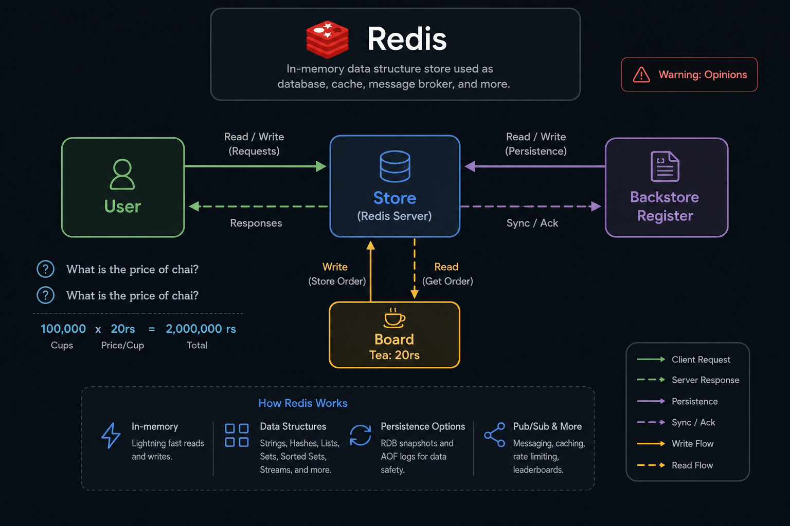
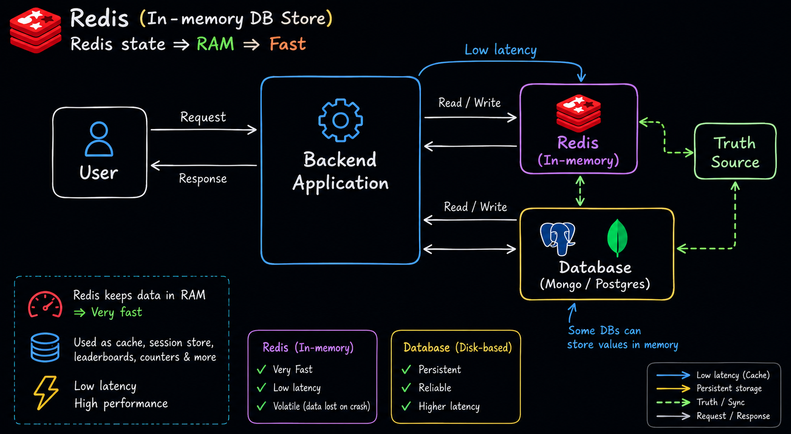
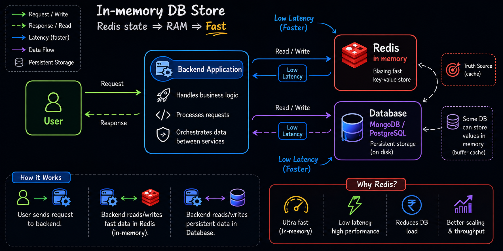
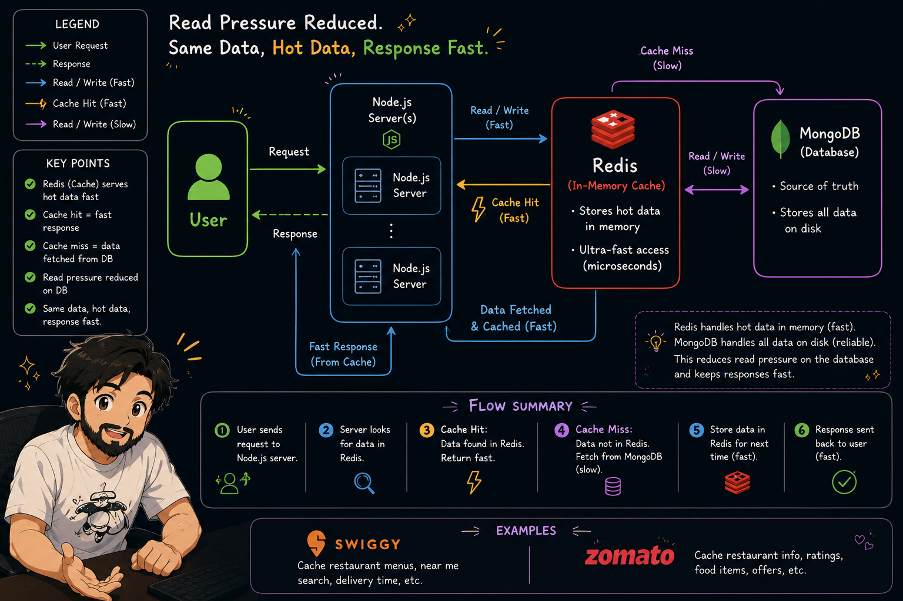
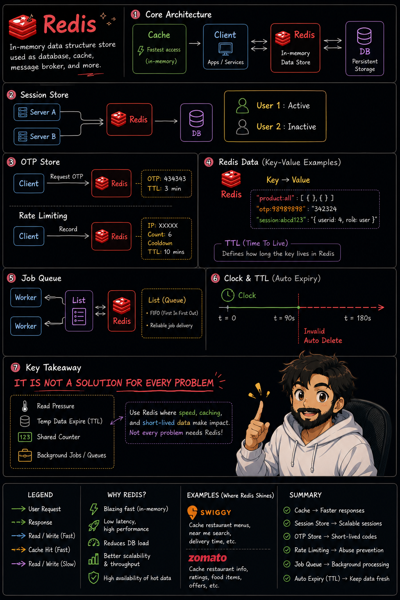

# 🚀 Redis Foundations: Complete Notes

## Video Link

<p align="center">
  <a href="https://youtu.be/5YqP18Gyop0">
    
  </a>
</p>

---

# 📦 SECTION 1: Architecture Foundations & Memory Mechanics

<p align="center">
  <a href="Images/R1.png">
    
  </a>
</p>

## 1. What is Redis?

Redis (**Remote Dictionary Server**) is an open-source, in-memory data structure store used as a:

* Database
* Cache
* Message Broker
* Session Store
* Queue System
* Real-Time Data Engine

Traditional databases such as PostgreSQL and MongoDB primarily store data on disk. Redis stores active data in **RAM (Memory)**.

Since RAM access is significantly faster than disk access, Redis can process read and write operations in microseconds, making it one of the fastest data stores available.

| Storage Medium      | Engine Example      | Read/Write Speed | Latency           |
| ------------------- | ------------------- | ---------------- | ----------------- |
| **RAM (In-Memory)** | **Redis**           | ⚡ Extremely Fast | Microseconds (μs) |
| **Disk Storage**    | PostgreSQL, MongoDB | Slower           | Milliseconds (ms) |

---

## 2. The Mechanics of a Request

When applications interact with Redis, data is served directly from memory rather than disk.

### Write Flow

Suppose we store:

```text
Tea Price = ₹20
```

Flow:

```text
User
  ↓
Write Request
  ↓
Redis Memory
  ↓
Persistence Layer
```

Redis writes the value into memory immediately and later synchronizes it with persistent storage if persistence is enabled.

---

### Read Flow

User asks:

```text
"What is the price of tea?"
```

Flow:

```text
User
  ↓
Read Request
  ↓
Redis Memory
  ↓
Response
```

Since the data is already in memory, Redis can return the result almost instantly without accessing disk storage.

---

## 3. Core Pillars of How Redis Operates

### ⚡ In-Memory Architecture

Redis stores active data inside RAM, allowing extremely fast read and write operations.

Benefits:

* Low latency
* High throughput
* Fast response times

---

### 📚 Rich Data Structures

Redis supports more than simple key-value storage.

Common data structures include:

* Strings
* Hashes
* Lists
* Sets
* Sorted Sets
* Streams

These structures allow Redis to solve a wide range of application problems efficiently.

---

### 💾 Persistence Options

Although Redis stores data in memory, it can also save data to disk for recovery purposes.

#### RDB (Redis Database)

Creates snapshots of the entire dataset at configured intervals.

Example:

```text
Every 5 minutes
→ Save Snapshot
```

Advantages:

* Compact storage
* Fast recovery
* Low disk usage

---

#### AOF (Append Only File)

Logs every write operation sequentially.

Example:

```text
SET tea 20
SET coffee 30
INCR visitors
```

On restart, Redis can replay these commands to reconstruct its previous state.

Advantages:

* Better durability
* More recent recovery point

---

### 📡 Pub/Sub and More

Redis also supports:

* Publish/Subscribe messaging
* Real-time notifications
* Counters
* Rate limiting
* Leaderboards
* Event-driven systems

---

# 🔀 SECTION 2: Multi-Tiered Database Integration

<p align="center">
  <a href="Images/R2.png">
    
  </a>
</p>


In modern production systems, Redis rarely operates as the only data store. Instead, it works alongside a traditional database.


<p align="center">
  <a href="Images/R2.png">
    
  </a>
</p>

---

## 1. Tiered Architectural Layout

A common architecture looks like this:

```text
                User
                  |
                  v
        Backend Application
                  |
          +-------+-------+
          |               |
          v               v
       Redis         PostgreSQL
    (Fast Cache)   (Source of Truth)
```

---

### Request Flow

1. User sends a request.
2. Backend application checks Redis first.
3. If data exists, Redis returns it immediately.
4. If data is unavailable, the backend queries the database.
5. Retrieved data may then be stored in Redis for future requests.

---

### Source of Truth

Redis is typically used for **hot data** (frequently accessed data).

The primary database remains the **Source of Truth**, responsible for:

* Permanent records
* Business transactions
* Historical data
* Long-term storage

---

## 2. Side-by-Side Comparison: Memory vs Disk

| Feature        | Redis (In-Memory)         | Database (Disk-Based)          |
| -------------- | ------------------------- | ------------------------------ |
| Performance    | Extremely Fast            | Slower                         |
| Latency        | Microseconds              | Milliseconds                   |
| Persistence    | Optional                  | Built-In                       |
| Reliability    | Moderate                  | High                           |
| Best Use Cases | Cache, Sessions, Counters | Business Records, Transactions |
| Data Lifetime  | Temporary / Hot Data      | Long-Term Data                 |

> 💡 **Note:** Some databases maintain internal memory caches, but they are fundamentally designed for durability rather than ultra-fast key-value access.

---

# ⚡ SECTION 3: The Cache Hit & Cache Miss Lifecycle

<p align="center">
  <a href="Images/R3.png">
    
  </a>
</p>

Caching is the most common Redis use case.

Its primary goal is to reduce read pressure on the database and improve response times.

---

## 1. Detailed Execution Workflow

### Step 1: User Request

Example:

```text
"What is the menu of Restaurant X?"
```

The request reaches the backend application.

---

### Step 2: Cache Verification

The backend checks Redis for the requested data.

---

### Step 3: Cache Hit (Fast Path)

The data exists in Redis.

```text
User
  ↓
Backend
  ↓
Redis
  ↓
Response
```

Result:

✅ No database query

✅ Extremely fast response

✅ Reduced database load

---

### Step 4: Cache Miss (Slow Path)

The data does not exist in Redis.

```text
User
  ↓
Backend
  ↓
Redis
  ↓
Not Found
  ↓
Database
```

The backend must retrieve the data from the database.

---

### Step 5: Cache Seeding

The retrieved data is stored in Redis.

```text
Database
   ↓
Redis
```

This ensures future requests become cache hits.

---

### Step 6: Response Delivery

The backend sends the data back to the user.

---

## 2. Scalability Example: The "Chai Shop" Scale

Imagine:

```text
100,000 users
```

simultaneously ask:

```text
"What is the price of tea?"
```

Tea Price:

```text
₹20
```

---

### Without Redis

```text
100,000 Requests
        ↓
     Database
```

The database must process every request.

Possible consequences:

* High CPU usage
* Increased latency
* Reduced performance
* Potential bottlenecks

---

### With Redis

First request:

```text
Request #1
   ↓
Cache Miss
   ↓
Database
   ↓
Redis Stores Value
```

Remaining requests:

```text
Request #2 → Request #100,000
             ↓
          Redis
             ↓
          Response
```

Benefits:

* Faster responses
* Lower database load
* Better scalability
* Improved user experience

---

## 3. Production Industry Implementations

### 🍔 Swiggy

Caches:

* Restaurant menus
* Nearby restaurant searches
* Delivery estimates
* Frequently viewed data

---

### 🍽️ Zomato

Caches:

* Restaurant details
* Ratings
* Popular food searches
* Promotional offers

These companies use Redis to serve millions of requests efficiently while protecting their primary databases.

---

# 🛠️ SECTION 4: Real-World Design Patterns & Expiration Mechanics

<p align="center">
  <a href="Images/R4.png">
    
  </a>
</p>
Redis provides built-in expiration mechanisms and optimized data structures that make it ideal for solving common backend engineering problems.

---

## 1. Distributed Session Storage

In load-balanced systems, users may interact with multiple application servers.

```text
Server A
Server B
Server C
```

Storing session data inside individual servers can cause inconsistencies.

Instead:

```text
Server A ─┐
Server B ─┼──► Redis Session Store
Server C ─┘
```

Example Session:

```json
{
  "userId": 101,
  "role": "admin"
}
```

Stored as:

```text
session:abcd123
```

Benefits:

* Shared across all servers
* Fast authentication
* Easy expiration
* Better scalability

---

## 2. Temporary OTP Stores & The TTL Engine

OTP codes are temporary by nature.

Example:

```text
OTP: 434343
TTL: 180 seconds
```

Redis automatically removes expired keys.

Timeline:

```text
t = 0s      OTP Valid
   |
   |
t = 180s    OTP Deleted
```

Benefits:

* No manual cleanup required
* Reduced storage overhead
* Improved security

---

## 3. API Rate Limiting

Redis is commonly used to prevent abuse and excessive requests.

Example:

```text
IP: 192.168.1.1
Request Count: 8
TTL: 10 Minutes
```

Every request increments a counter.

If the threshold is exceeded:

```text
Request Rejected
```

Common Use Cases:

* Login APIs
* Payment APIs
* Public APIs
* Authentication Services

---

## 4. Distributed Job Queues

Redis Lists can be used to build background task queues.

Architecture:

```text
Producer
   |
LPUSH
   |
Redis Queue
   |
RPOP
   |
Worker
```

Example Jobs:

```text
Send Welcome Email
Generate Monthly Report
Process Payment
Render Video
```

Workers continuously process tasks from the queue.

Benefits:

* Background processing
* Better scalability
* Faster user responses
* Reduced server blocking

---

## 5. Redis Key-Value Data Schema Mockups

### Strings

```json
{
  "tea_price": "20"
}
```

Use Cases:

* Counters
* Prices
* Configuration Flags

---

### Hashes

```json
{
  "session:abcd123": {
    "userid": "4",
    "role": "user"
  }
}
```

Use Cases:

* User Profiles
* Product Information

---

### Lists

```json
{
  "tasks:queue": [
    "send_email_job",
    "render_video_job"
  ]
}
```

Use Cases:

* Job Queues
* Activity Feeds

---

### Sets

```json
{
  "unique:visitors": [
    "user_1",
    "user_5",
    "user_99"
  ]
}
```

Use Cases:

* Unique Visitors
* Tags
* User Interests

---

### Sorted Sets

```json
{
  "leaderboard:scores": {
    "Player_Bob": 80,
    "Player_Alice": 95,
    "Player_John": 100
  }
}
```

Use Cases:

* Rankings
* Leaderboards
* Real-Time Scores

---

# 🛑 Summary Cheat Sheet: When to Deploy Redis

## ✅ Use Redis When

* You need ultra-fast read responses.
* You want to reduce database load.
* You need caching.
* You are storing sessions.
* You need OTP expiration.
* You need API rate limiting.
* You need distributed counters.
* You need job queues.
* You need leaderboards.
* You need Pub/Sub messaging.

---

## ❌ Avoid Redis When

* Your dataset exceeds available RAM capacity.
* You need complex relational joins.
* You require long-term archival storage.
* You need strict ACID guarantees for every operation.
* Your application relies heavily on complex analytical queries.

---

## 🏆 The Golden Rule of Redis Architecture

> Use Redis for **hot, frequently accessed, and short-lived data**.
>
> Use PostgreSQL, MongoDB, or another persistent database as the **Source of Truth**.
>
> Redis works best as a high-speed layer that reduces latency, improves scalability, and protects your primary database from excessive load.
>
> **Redis complements a database—it does not replace one.** 🚀

---


# 🔗 Useful Resources & Redis Alternatives

## Official Redis Resources

* [Redis Official Website](https://redis.io)
* [Redis Documentation](https://redis.io/docs/latest/)


---

## Redis-Compatible Alternatives

### 1. KeyDB

A high-performance, multithreaded Redis-compatible database designed to improve throughput while maintaining Redis compatibility.

* [KeyDB Documentation](https://docs.keydb.dev)

### 2. DragonflyDB

A modern in-memory datastore that is Redis-compatible and optimized for high concurrency and lower infrastructure costs.

* [DragonflyDB](https://www.dragonflydb.io)

### 3. Valkey

An open-source, community-driven fork of Redis focused on long-term open governance and Redis protocol compatibility.

* [Valkey](https://valkey.io)

### 4. Memcached

A lightweight distributed memory caching system primarily used for simple key-value caching workloads.

* [Memcached](https://memcached.org)

### 5. Upstash

A serverless Redis platform designed for cloud-native applications, edge computing, and serverless environments.

* [Upstash](https://upstash.com)

---
