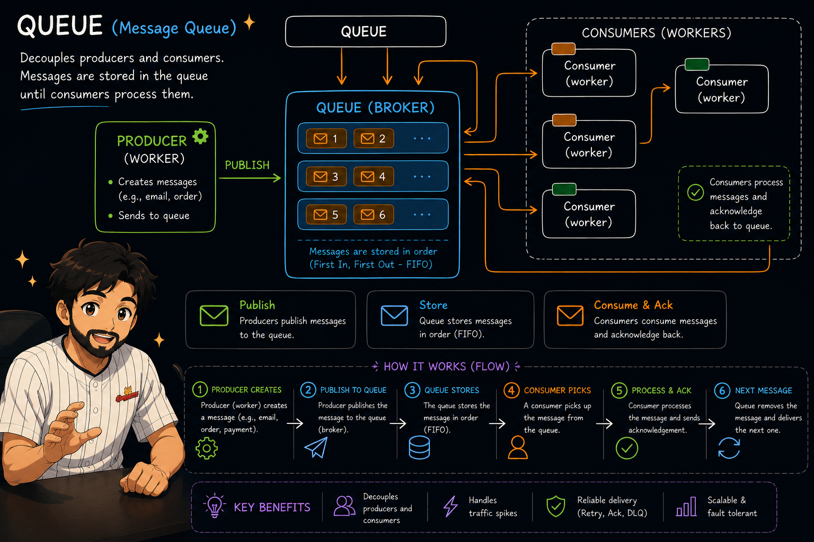

# 06-Email-queue-with-redis-lists

## Video Link

<p align="center"> <a href="https://youtu.be/r005ciJ55DY">  </a> </p>

---


<p align="center">
  <a href="Images/queue.png">
    
  </a>
</p>

---
Your code is correct for testing **Redis Queue using Lists**.

You are using:

```js id="x6p0rq"
await redis.lpush(QUEUE_KEY, JSON.stringify(job));
```

to push jobs into the queue and:

```js id="7w5owj"
await redis.rpop(QUEUE_KEY);
```

to process them.

This creates **FIFO behavior**:

* `LPUSH` → add to left
* `RPOP` → remove from right

So first inserted job gets processed first.

---

## API Testing

---

# 1. Add Email Job to Queue

**POST**

```text id="m7l7jv"
http://localhost:3000/send-email
```

Body:

```json id="yl3j9f"
{
  "to": "prince@example.com",
  "subject": "Welcome Email",
  "body": "Hello PRINCE, welcome to Chai aur Redis!"
}
```

cURL:

```bash id="lq8d4e"
curl -X POST http://localhost:3000/send-email \
-H "Content-Type: application/json" \
-d '{"to":"prince@example.com","subject":"Welcome Email","body":"Hello PRINCE, welcome to Chai aur Redis!"}'
```

Response:

```json id="0ixu8m"
{
  "message": "Email added to queue"
}
```

---

# 2. Process One Email

**GET**

```text id="nyc5e1"
http://localhost:3000/emails/process-one
```

cURL:

```bash id="d0qud7"
curl http://localhost:3000/emails/process-one
```

Response:

```json id="vw3vkn"
{
  "message": "Email Sent",
  "job": {
    "to": "prince@example.com",
    "subject": "Welcome Email",
    "body": "Hello PRINCE, welcome to Chai aur Redis!",
    "createdAt": "2025-01-01T12:00:00.000Z"
  }
}
```

Console:

```text id="54yd9m"
Processing email to: prince@example.com, subject: Welcome Email
```

---

# 3. Process Empty Queue

If queue is empty:

```bash id="7ykjxe"
curl http://localhost:3000/emails/process-one
```

Response:

```json id="zkydc5"
{
  "message": "No Jobs (email) in the queue"
}
```

---

## Redis Commands Used

### Queue Commands

* `LPUSH` → Add job to queue
* `RPOP` → Remove and process oldest job

---

## Queue Flow

Job 1:

```text id="v0jv4x"
Welcome Email
```

Job 2:

```text id="ekn1qa"
Password Reset
```

Job 3:

```text id="76z6zh"
Order Confirmation
```

Stored:

```text id="37h4x8"
LEFT → [Job3, Job2, Job1] → RIGHT
```

Processing:

```text id="r8ddgq"
RPOP → Job1
RPOP → Job2
RPOP → Job3
```

FIFO maintained.

---

## Issues with this approach

1. **Job Loss**
   If server crashes after `RPOP`, job is lost.

2. **No Retry Mechanism**
   Failed jobs cannot be retried.

3. **No Worker Acknowledgment**
   Cannot confirm successful processing.

4. **Scaling Issues**
   Multiple workers can create race conditions.

---

Best test flow:

1. POST `/send-email`
2. POST `/send-email`
3. POST `/send-email`
4. GET `/emails/process-one`
5. GET `/emails/process-one`
6. GET `/emails/process-one`
7. GET `/emails/process-one`

This shows queue behavior clearly.
