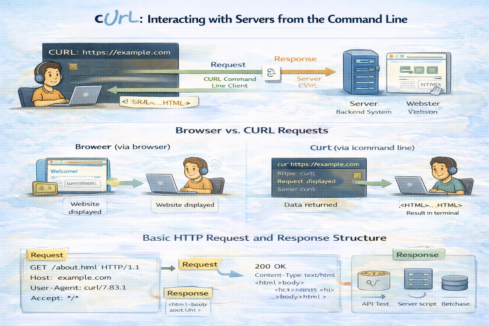
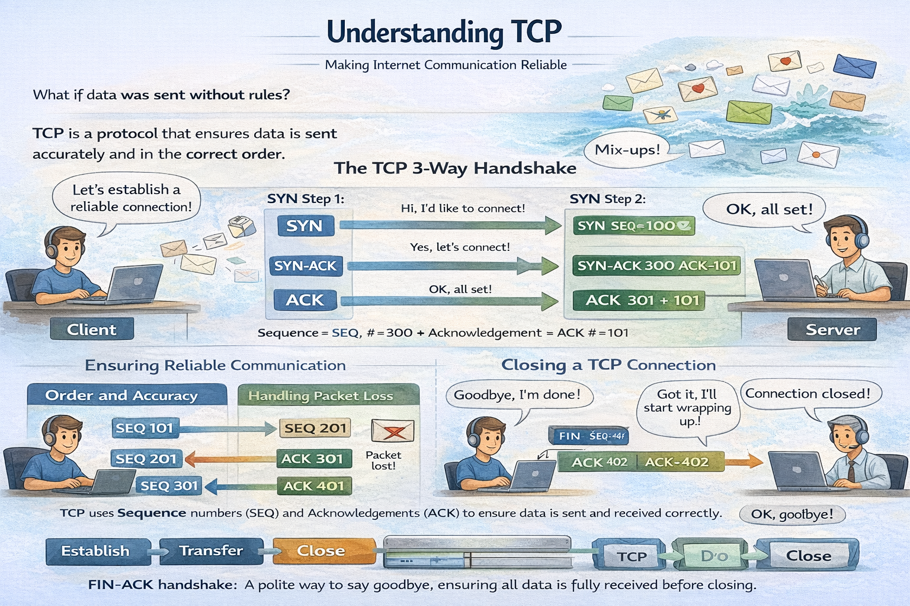

# 🌐 Networking Blogs
## [Understanding Network Devices](https://princekumar-engineer.hashnode.dev/understanding-network-devices)

<a href="https://princekumar-engineer.hashnode.dev/understanding-network-devices" align="center">
      

      
    

  </a>
  
 

## [TCP vs UDP: When to Use What, and How TCP Relates to HTTP](https://princekumar-engineer.hashnode.dev/tcp-vs-udp-when-to-use-what-and-how-tcp-relates-to-http)

<a href="https://princekumar-engineer.hashnode.dev/tcp-vs-udp-when-to-use-what-and-how-tcp-relates-to-http" align="center">
      

      
    

  </a>

 

## [How DNS Resolution Works](https://princekumar-engineer.hashnode.dev/how-dns-resolution-works)

<a href="https://princekumar-engineer.hashnode.dev/how-dns-resolution-works" align="center">
      

      
    

  </a>

 

## [DNS Record Types Explained From Confusion to Clarity](https://princekumar-engineer.hashnode.dev/dns-record-types-explained)

<a href="https://princekumar-engineer.hashnode.dev/dns-record-types-explained" align="center">
      

      
    

  </a>

 

## [Getting Started with cURL](https://princekumar-engineer.hashnode.dev/getting-started-with-curl)

<a href="https://princekumar-engineer.hashnode.dev/getting-started-with-curl" align="center">
      

      
    

  </a>

 

## [TCP Working: 3-Way Handshake & Reliable Communication](https://princekumar-engineer.hashnode.dev/tcp-working-3-way-handshake-and-reliable-communication)

<a href="https://princekumar-engineer.hashnode.dev/tcp-working-3-way-handshake-and-reliable-communication" align="center">
      

      
    

  </a>

 

## [How a Browser Works: A Beginner-Friendly Guide to Browser Internals](https://princekumar-engineer.hashnode.dev/how-a-browser-works-a-beginner-friendly-guide-to-browser-internals)

<a href="https://princekumar-engineer.hashnode.dev/how-a-browser-works-a-beginner-friendly-guide-to-browser-internals" align="center">
      

      
    

  </a>

 