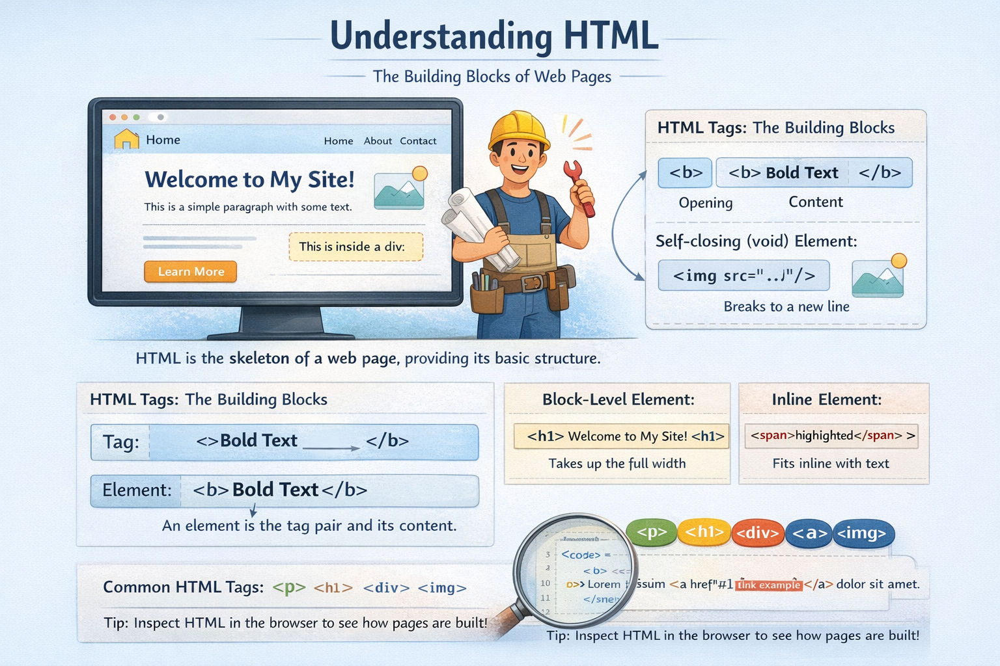
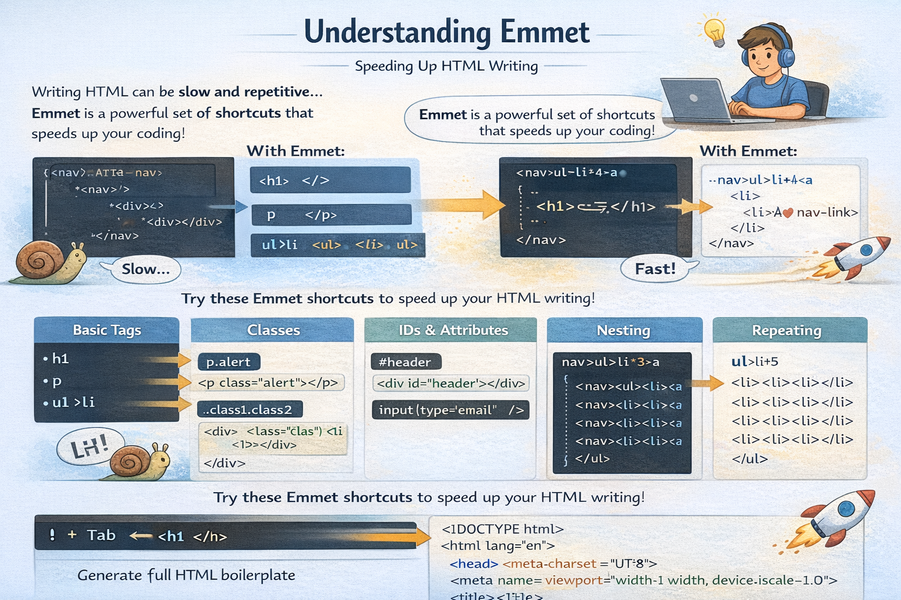

# 🌐 HTML & CSS Blogs

## [Understanding HTML Tags and Elements](https://princekumar-engineer.hashnode.dev/understanding-html-tags-and-elements)

<a href="https://princekumar-engineer.hashnode.dev/understanding-html-tags-and-elements" align="center">
      

      
    

  </a>

 
  
  ## [Emmet for HTML: A Beginner’s Guide to Writing Faster Markup](https://princekumar-engineer.hashnode.dev/emmet-for-html-a-beginners-guide-to-writing-faster-markup)
  
  <a href="https://princekumar-engineer.hashnode.dev/emmet-for-html-a-beginners-guide-to-writing-faster-markup" align="center">
        

        
      

    </a>

 

## [CSS Selectors 101: Targeting Elements with Precision](https://princekumar-engineer.hashnode.dev/css-selectors-101-targeting-elements-with-precision)

  <a href="https://princekumar-engineer.hashnode.dev/css-selectors-101-targeting-elements-with-precision" align="center">
        

        
      

    </a>    

 
