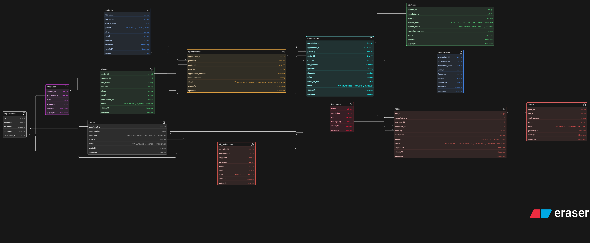
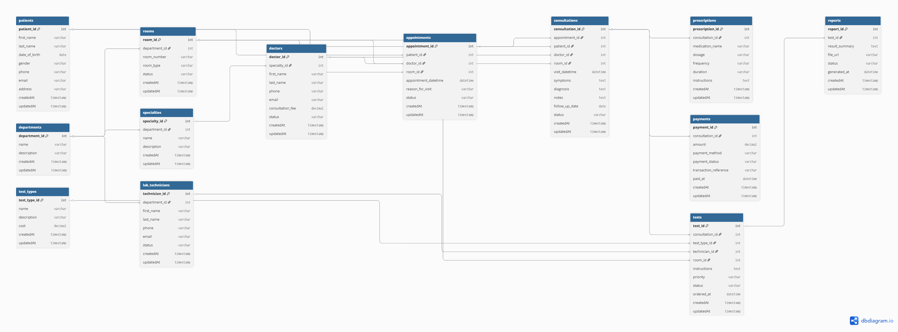

# Clinic Appointment and Diagnostics Platform — ER Design

## ER Diagram (PNG)

The ER diagram is provided in PNG format from two tools:

### Eraser.io Version


### dbdiagram.io Version


Both diagrams are identical and included for readability.
---
## Thought Process

The goal was to design a clean, scalable clinic database that models the real-world workflow:

Patient → Appointment → Consultation → Tests → Reports → Payment

However, real clinics also allow **walk-in patients**, so consultation must exist **with or without appointment**.

Final workflow supported:

- appointment-based visit  
- walk-in consultation  
- diagnostics after consultation  
- report generated later  
- payment after visit  

To support this, **consultation is designed as the central entity**.

---

# Core Workflow

### Appointment-based visit

Patient → Appointment → Consultation → Tests → Reports → Payment

### Walk-in visit

Patient → Consultation → Tests → Reports → Payment

This ensures flexibility and realistic clinic behavior.

---

# Key Design Decision

### Appointment vs Consultation

Appointment = booking  
Consultation = actual doctor visit  

Not every appointment results in consultation.  
Not every consultation requires appointment.

Therefore:

- Appointment → 0..1 Consultation  
- Consultation → optional appointment  

This is implemented by making the appointment reference optional.

Consultation may exist without an appointment:

```sql
`consultations.appointment_id` is nullable
```

This allows walk-in patients.

---

# Entities Overview

## Patients
Stores patient information.  
One patient can have multiple appointments and consultations.

---

## Departments
Represents clinic divisions such as:

- General Medicine  
- Cardiology  
- Radiology  
- Laboratory  

Used to group:

- doctors  
- rooms  
- technicians  

---

## Rooms
Represents physical clinic rooms.

Room types:

- CONSULTATION  
- LAB  
- WAITING  
- PROCEDURE  

Rooms are used by:

- appointments  
- consultations  
- tests  

---

## Specialties
Doctor specialization:

- Dentist  
- Cardiologist  
- Dermatologist  

Each doctor belongs to one specialty.

---

## Doctors
Stores doctor information.

Doctors:

- belong to specialty  
- attend appointments  
- conduct consultations  

---

## Lab Technicians
Represents staff performing diagnostic tests.

Technician:

- belongs to department  
- performs tests  
- assigned to diagnostics  

---

## Appointments
Represents booking only.

Possible states:

- scheduled  
- confirmed  
- completed  
- cancelled  
- no show  

Appointments may or may not create consultations.

---

## Consultations (Central Entity)

Represents actual doctor visit.

Consultation may come from:

- appointment  
- walk-in patient  

Consultation connects:

- prescriptions  
- tests  
- payment  

---

## Prescriptions

Stores medicines prescribed during consultation.

One consultation → many prescriptions

---

## Test Types

Reusable diagnostic definitions:

- Blood Test  
- X-Ray  
- MRI  
- ECG  

---

## Tests

Diagnostics ordered during consultation.

Each test:

- belongs to consultation  
- has test type  
- assigned technician  
- assigned room  
- produces report  

One consultation → many tests.

---

## Reports

Generated after test completion.

One test → one report.

Reports may be generated later.

---

## Payments

Payment recorded per consultation.

Includes:

- consultation fee  
- test cost  
- additional charges  

---

# Tables

- patients  
- departments  
- rooms  
- specialties  
- doctors  
- lab_technicians  
- appointments  
- consultations  
- prescriptions  
- test_types  
- tests  
- reports  
- payments  

---

# Relationships and Reasoning

## Patient Relationships

patients 1 → many appointments  
patients 1 → many consultations  

Patients can visit clinic multiple times.

---

## Doctor Relationships

doctors 1 → many appointments  
doctors 1 → many consultations  

Doctors attend multiple patients.

---

## Appointment → Consultation

appointments 1 → 0..1 consultations  

Reason:

- appointment cancelled  
- patient no show  
- rescheduled  

---

## Consultation → Appointment (Optional)

consultations.appointment_id nullable  

Reason:

- walk-in patients  
- emergency visit  
- direct consultation  

---

## Consultation → Prescriptions

consultations 1 → many prescriptions  

Doctor can prescribe multiple medicines.

---

## Consultation → Tests

consultations 1 → many tests  

Doctor may order multiple diagnostics.

---

## Test → Report

tests 1 → 1 report  

Each test generates one report.

---

## Consultation → Payment

consultations 1 → 1 payment  

Billing done per visit.

---

## Department Relationships

departments 1 → many rooms  
departments 1 → many specialties  
departments 1 → many lab_technicians  

Departments organize clinic resources.

---

## Specialty → Doctor

specialties 1 → many doctors  

Multiple doctors share same specialty.

---

## Technician → Tests

lab_technicians 1 → many tests  

Technician performs diagnostics.

---

# Enum Design

## Appointment Status

- SCHEDULED  
- CONFIRMED  
- COMPLETED  
- CANCELLED  
- NO_SHOW  

## Consultation Status

- IN_PROGRESS  
- COMPLETED  
- CANCELLED  

## Test Status

- ORDERED  
- SAMPLE_COLLECTED  
- IN_PROGRESS  
- COMPLETED  
- CANCELLED  

## Test Priority

- ROUTINE  
- URGENT  
- STAT  

## Payment Status

- PENDING  
- PAID  
- FAILED  
- REFUNDED  

## Payment Method

- CASH  
- CARD  
- UPI  
- NET_BANKING  
- INSURANCE  

## Room Type

- CONSULTATION  
- LAB  
- WAITING  
- PROCEDURE  

---

# ER Flow Summary

Department → Specialty → Doctor  

Patient → Appointment → Consultation  
Patient → Consultation (Walk-in)

Consultation → Prescriptions  
Consultation → Tests → Report  
Consultation → Payment  

---

# Design Highlights

✔ multiple visits per patient  
✔ appointment vs consultation separation  
✔ walk-in patient support  
✔ multiple prescriptions per consultation  
✔ multiple tests per consultation  
✔ technician assignment for diagnostics  
✔ room allocation for visits and tests  
✔ department and specialty grouping  
✔ test reports generated after diagnostics  
✔ payment linked to consultation  
✔ normalized database structure  
✔ scalable architecture  
✔ new doctors can be added without schema changes  
✔ new departments and rooms supported easily  
✔ new diagnostic tests added via test_types  
✔ supports both appointment-based and walk-in workflows  
✔ clean separation of booking, consultation, diagnostics, and billing

---

# Assumptions

- one report per test  
- one payment per consultation  
- one doctor per consultation  
- one technician per test  
- one room per visit  

---

# Conclusion

This ER design models a realistic clinic workflow while supporting:

- appointment visits  
- walk-in consultations  
- diagnostics workflow  
- report generation  
- billing  

The schema is normalized, scalable, and suitable for real clinic systems.