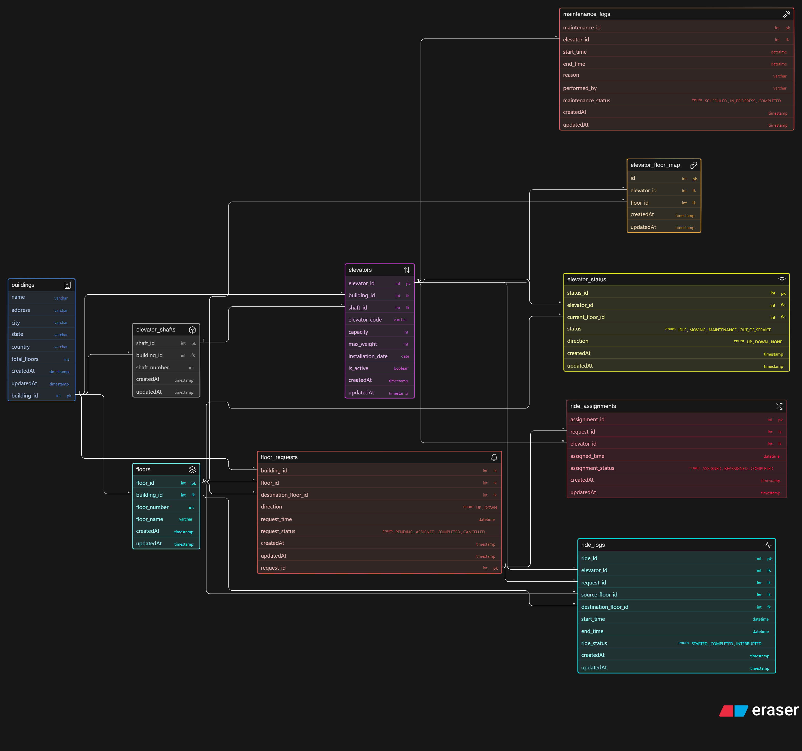
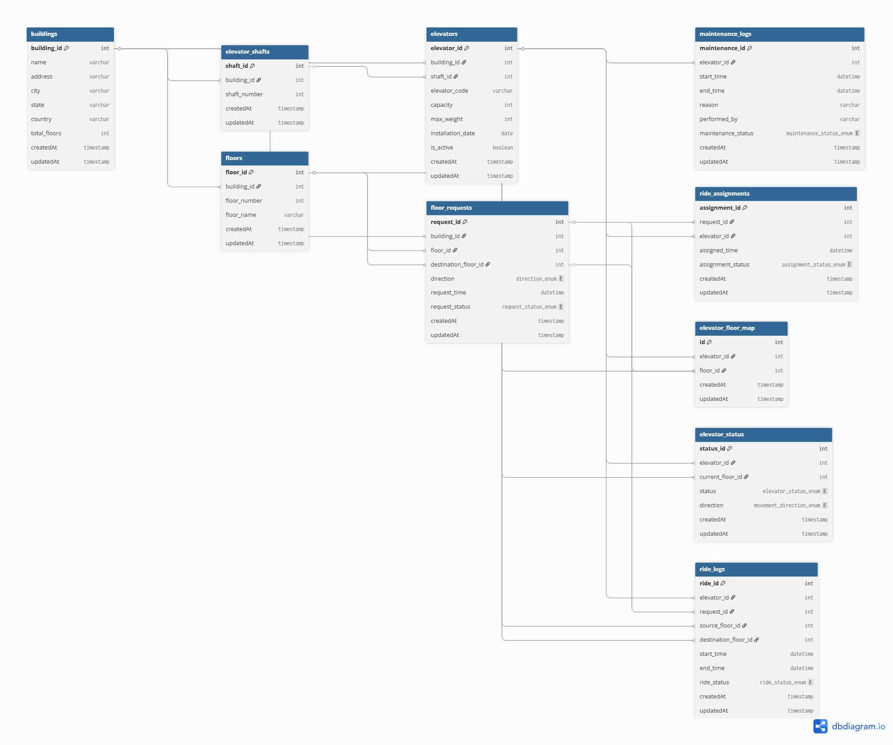

# Smart Elevator Control

--- 

## ER Diagram (PNG)

The ER diagram is provided in PNG format from two tools:

### Eraser.io Version with dbml


### dbdiagram.io Version with dbml


Both diagrams are identical and included for readability.

---

## Overview

This project designs a database schema for a **Smart Elevator Control Platform** used in large commercial buildings such as malls, airports, hospitals, and corporate towers.

The system manages multiple buildings, elevators, floors, ride requests, assignments, maintenance tracking, and ride history.

The goal is to support real-time elevator dispatching while also maintaining historical logs for analytics and monitoring.

---

# System Requirements Covered

The design supports:

* Multiple buildings
* Multiple elevators per building
* Floors per building
* Elevators serving multiple floors
* Multiple elevators serving same floor
* Floor request generation
* Request allocation to elevators
* Ride logging
* Elevator status tracking
* Maintenance tracking
* Usage analytics
* Pending request monitoring

---

# Entities

### 1. buildings

Stores building information.

### 2. floors

Stores floors belonging to a building.

### 3. elevator_shafts

Represents physical shafts inside a building.

### 4. elevators

Stores elevator configuration details.

### 5. elevator_floor_map

Many-to-many mapping between elevators and floors.

Allows:

* one elevator → multiple floors
* one floor → multiple elevators

### 6. floor_requests

Requests generated from floors.

Tracks:

* source floor
* destination floor
* direction
* status

### 7. ride_assignments

Maps request to assigned elevator.

Ensures:

* one request → one assignment

### 8. ride_logs

Stores completed rides for analytics.

Tracks:

* source floor
* destination floor
* start time
* end time

### 9. elevator_status

Stores real-time elevator state.

Possible values:

* IDLE
* MOVING
* MAINTENANCE
* OUT_OF_SERVICE

### 10. maintenance_logs

Tracks elevator maintenance history.

Allows:

* temporary disable
* maintenance history
* technician tracking

---

# Relationships

## Building Relationships

One building contains many floors

```
buildings 1 ─── N floors
```

One building contains many elevators

```
buildings 1 ─── N elevators
```

One building contains many shafts

```
buildings 1 ─── N elevator_shafts
```

---

## Shaft Relationships

One shaft contains one elevator

```
elevator_shafts 1 ─── 1 elevators
```

---

## Elevator Floor Mapping

Many-to-many relationship

```
elevators N ─── N floors
```

Handled using:

```
elevator_floor_map
```

---

## Floor Request Flow

One floor generates many requests

```
floors 1 ─── N floor_requests
```

---

## Ride Assignment

One request assigned to one elevator

```
floor_requests 1 ─── 1 ride_assignments
```

One elevator handles many assignments

```
elevators 1 ─── N ride_assignments
```

---

## Ride Logs

One elevator completes many rides

```
elevators 1 ─── N ride_logs
```

One request produces one ride log

```
floor_requests 1 ─── 1 ride_logs
```

---

## Elevator Status

One elevator has multiple status updates

```
elevators 1 ─── N elevator_status
```

---

## Maintenance Tracking

One elevator has multiple maintenance records

```
elevators 1 ─── N maintenance_logs
```

---

# Design Decisions

## Static vs Dynamic Separation

Static tables:

* buildings
* floors
* elevators
* elevator_shafts

Dynamic tables:

* floor_requests
* ride_assignments
* elevator_status

History tables:

* ride_logs
* maintenance_logs

---

## Why elevator_status is separate

Elevator state changes frequently.
Keeping it separate avoids overwriting configuration data.

---

## Why ride_assignments table exists

Separates:

* request creation
* elevator allocation

Allows:

* reassignment
* dispatch optimization

---

## Why elevator_floor_map exists

Elevators can serve multiple floors
Floors can be served by multiple elevators

This requires many-to-many mapping.

---

# Questions This Design Can Answer

How many buildings are connected?
→ buildings table

How many elevators in a building?
→ elevators filtered by building

Which elevator serves which floors?
→ elevator_floor_map

Which requests are pending?
→ floor_requests status

Which elevator handled request?
→ ride_assignments

How many rides today?
→ ride_logs

Which elevator used most?
→ ride_logs grouped by elevator

Can elevator be disabled?
→ elevator_status = MAINTENANCE

Maintenance history?
→ maintenance_logs

Ride analytics?
→ ride_logs

---

# ER Diagram Scope

This design includes:

* multi-building infrastructure
* multi-elevator dispatch
* request allocation
* ride tracking
* maintenance tracking
* status monitoring
* analytics ready schema

---

Follow along as I build and learn in public 🚀