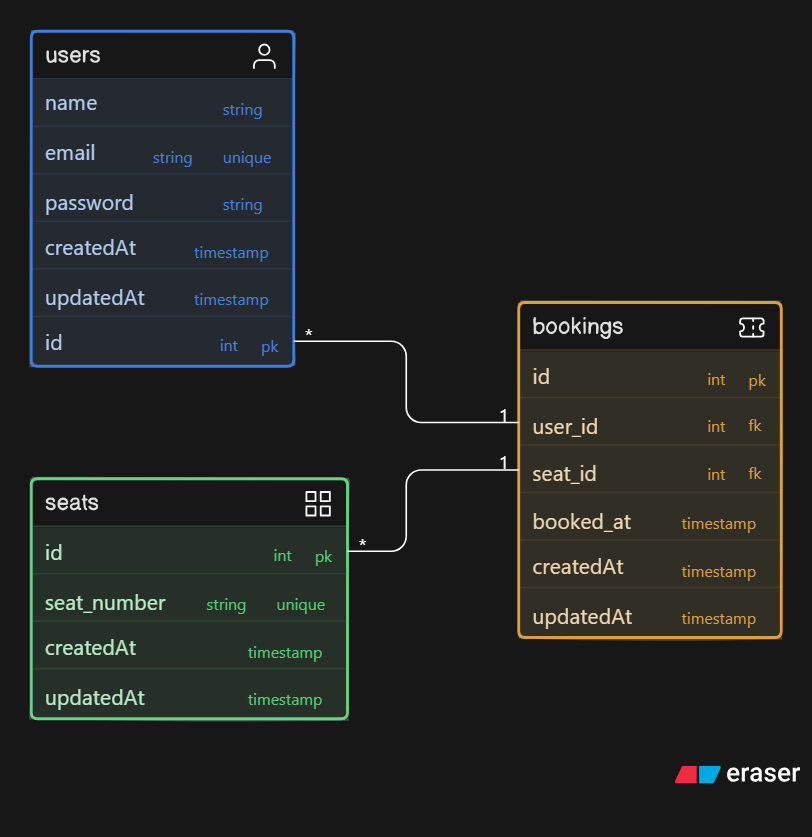

# 🎟️ Book My Ticket (Backend)

A simple movie seat booking backend built with **Node.js, Express, and PostgreSQL**.
This project includes authentication, seat booking, and concurrency-safe transactions.
---
## 🗄️ Database Diagram


---

## 🚀 Features

* ✅ User Registration & Login
* 🔐 JWT Authentication
* 🎟️ Seat Booking System
* 🔒 Protected Routes (Only logged-in users can book)
* 🚫 Prevent Duplicate Seat Booking
* 🔗 Booking linked to users
* ⚡ PostgreSQL Transactions (`FOR UPDATE` locking)

---

## 🛠️ Tech Stack

* Node.js
* Express.js
* PostgreSQL (`pg`)
* JWT (`jsonwebtoken`)
* Bcrypt (`bcrypt`)
* CORS

---

## 📂 Project Setup

### 1. Clone the Repository

```bash
git clone <your-repo-url>
cd book-my-ticket
```

---

### 2. Install Dependencies

```bash
npm install
```

---

### 3. Setup PostgreSQL

Create database:

```sql
CREATE DATABASE sql_class_2_db;
```

---

### 4. Create Tables (SQL)

Run this inside pgAdmin / psql:

```sql
-- Users table
CREATE TABLE IF NOT EXISTS users (
  id SERIAL PRIMARY KEY,
  name VARCHAR(255),
  email VARCHAR(255) UNIQUE,
  password VARCHAR(255)
);

-- Seats table
CREATE TABLE IF NOT EXISTS seats (
  id SERIAL PRIMARY KEY,
  name VARCHAR(255),
  isbooked INT DEFAULT 0
);

-- Bookings table
CREATE TABLE IF NOT EXISTS bookings (
  id SERIAL PRIMARY KEY,
  user_id INT REFERENCES users(id),
  seat_id INT UNIQUE
);

-- Insert seats (only if empty)
INSERT INTO seats (isbooked)
SELECT 0 FROM generate_series(1, 20)
WHERE NOT EXISTS (SELECT 1 FROM seats LIMIT 1);
```

---

### 5. Run the Server

```bash
node index.mjs
```

Server will start on:

```
http://localhost:8080
```

---

## 🗄️ Database Schema

### Users

* id
* name
* email (unique)
* password

### Seats

* id
* name
* isbooked

### Bookings

* id
* user_id (FK)
* seat_id (unique → prevents duplicate booking)

---

## 🔐 Authentication

Uses JWT tokens.

### Header format:

```
Authorization: Bearer <token>
```

---

## 📡 API Endpoints

### 🔹 Public Routes

#### Get all seats

```
GET /seats
```

---

### 🔹 Auth Routes

#### Register

```
POST /register
```

Body:

```json
{
  "name": "Prince",
  "email": "prince@test.com",
  "password": "123456"
}
```

---

#### Login

```
POST /login
```

Response:

```json
{
  "token": "JWT_TOKEN"
}
```

---

### 🔹 Protected Routes

#### Book Seat

```
PUT /:id/:name
```

Headers:

```
Authorization: Bearer <token>
```

---

## 🧪 Testing (Postman)

1. Register user
2. Login → copy token
3. Add token in headers
4. Book seat

---

## ⚠️ Important Notes

* ❌ Do NOT send `Bearer Bearer <token>`
* ✅ Only one `Bearer` allowed
* 🔒 Uses transaction + row locking (`FOR UPDATE`)
* 🚫 Prevents duplicate booking

---

## 🔥 Future Improvements

* Cancel booking
* View user bookings
* Payment integration
* Frontend UI (React)
* Token expiry & refresh tokens

---