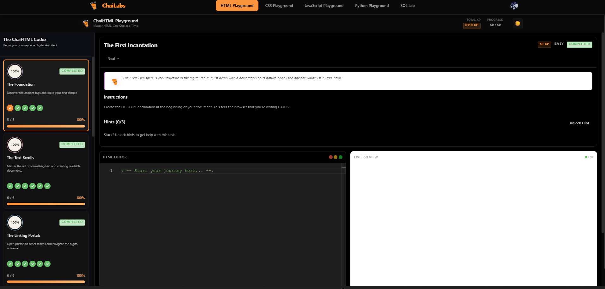
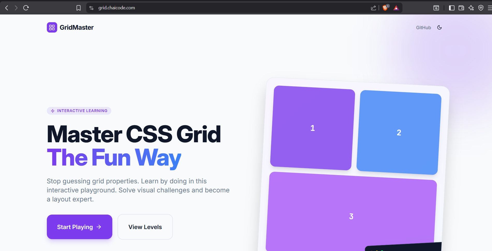
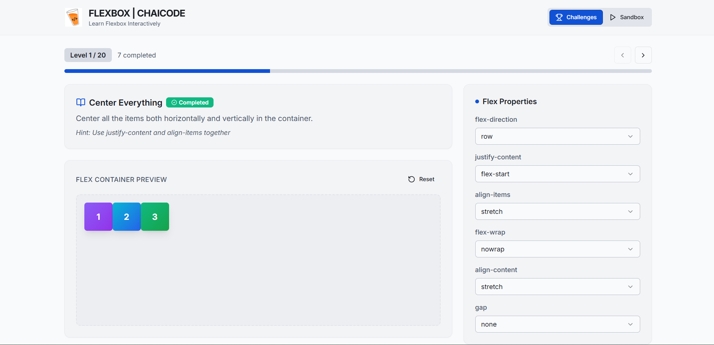
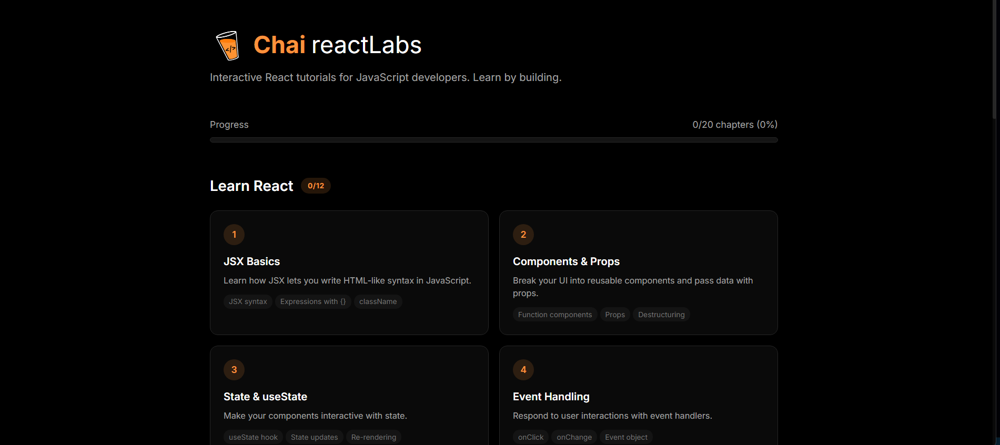

# 🧪 Chaicode Labs

Hands on coding labs and interactive playgrounds for practicing frontend development, JavaScript, React, and SQL concepts.

These labs help improve problem solving, coding skills, and real world implementation through interactive exercises and challenges.

---

# 🚀 Available Labs

<table>
<tr>

<td align="center" width="33%">

## 🌐 HTML Playground

Practice:
- Semantic HTML
- Forms & Inputs
- Tables
- Accessibility
- Page Structures

🔗 https://labs.chaicode.com/html

</td>

<td align="center" width="33%">

## 🎨 CSS Playground

Practice:
- CSS Fundamentals
- Responsive Design
- Animations
- Media Queries
- Modern Styling

🔗 https://labs.chaicode.com/css

</td>

<td align="center" width="33%">

## 📦 Flexbox Lab

Practice:
- Flex Direction
- Alignment
- Justify Content
- Responsive Layouts
- Flexbox Patterns

🔗 https://flexbox.chaicode.com/

</td>

</tr>

<tr>

<td align="center" width="33%">

## 🧩 Grid Lab

Practice:
- CSS Grid
- Grid Areas
- Grid Columns & Rows
- Responsive Grids
- Complex Layouts

🔗 https://grid.chaicode.com/

</td>

<td align="center" width="33%">

## ⚡ JavaScript Playground

Practice:
- DOM Manipulation
- Events
- Arrays & Objects
- Async JavaScript
- Problem Solving

🔗 https://labs.chaicode.com/js

</td>

<td align="center" width="33%">

## ⚛️ React Lab

Practice:
- Components
- Props & State
- Hooks
- Forms
- React Projects

🔗 https://react.chaicode.com/

</td>

</tr>

<tr>

<td align="center" width="33%">

## 🗄 SQL Lab

Practice:
- SQL Queries
- Joins
- Aggregations
- Filtering & Sorting
- Database Design

🔗 https://labs.chaicode.com/sql

</td>

</tr>
</table>

---

# 📸 Labs Preview

  

  

  

  

---

# 🎯 Goals

- Practice consistently
- Build strong fundamentals
- Improve debugging skills
- Learn by building
- Solve real coding challenges

---

# ☕ Learning Approach

> Learn concepts → Practice in labs → Build projects → Repeat 🚀