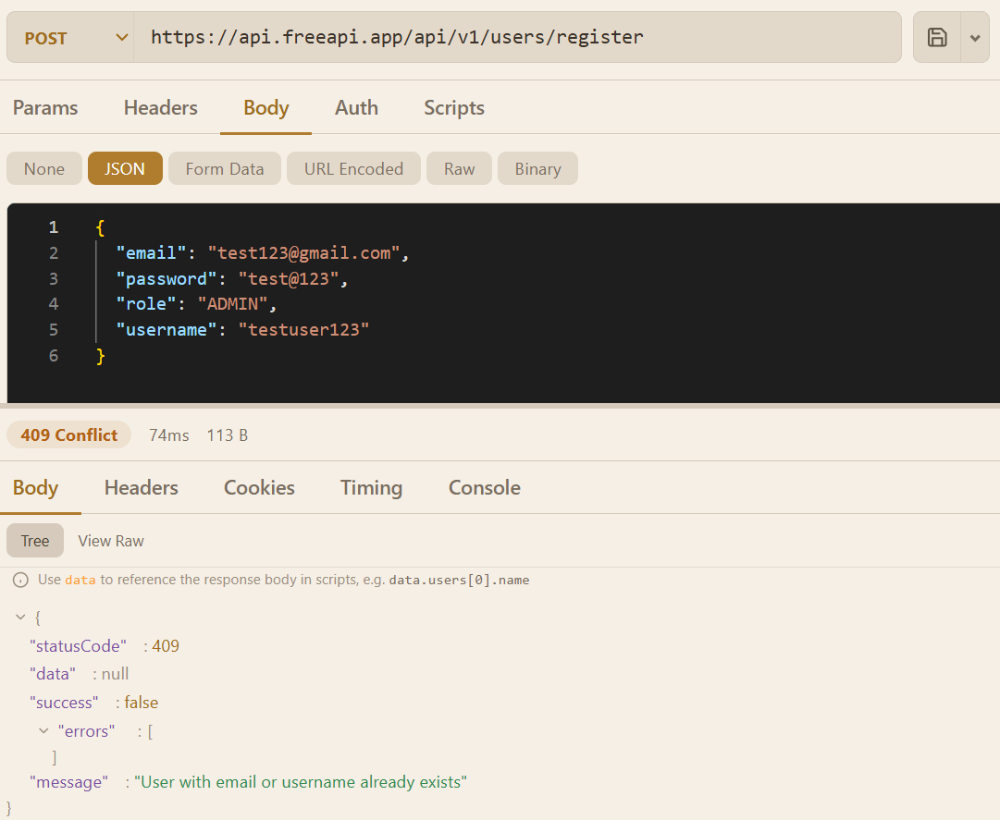
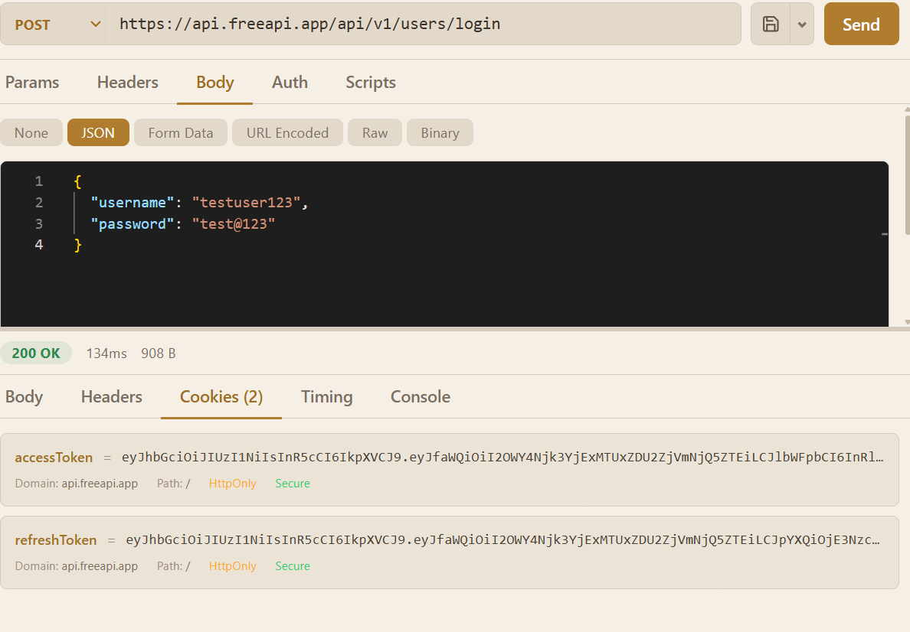
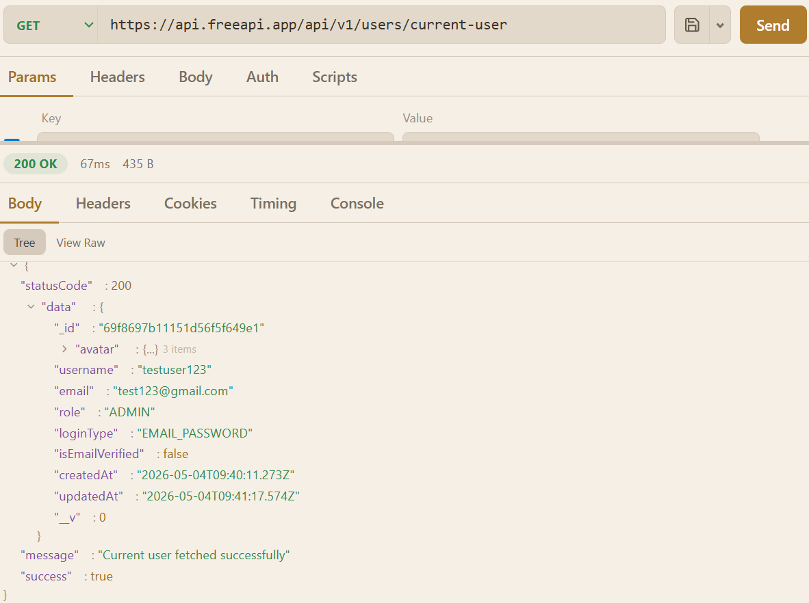
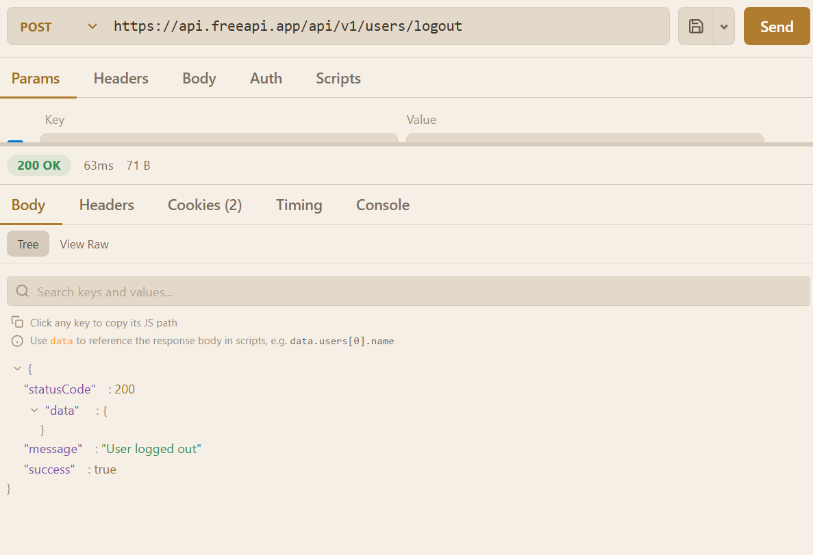

# 🔐 Authentication App

### 🚀 Web Dev Cohort 2026 Project

---

## 🌐 Live Demo

🔗 [Live Preview](https://freeapi-build-an-authentication-app.netlify.app/)

---

## 🧠 Overview

This project is a **frontend authentication application** built using HTML, CSS, and JavaScript.

It demonstrates a complete authentication flow using the FreeAPI Authentication module, including:

* User registration
* Login with session handling
* Fetching current user
* Logout functionality

---

## 🎯 Objectives

* Understand authentication flow
* Work with API requests using `fetch`
* Handle sessions and cookies
* Manage frontend user state
* Display success and error messages

---

## 🖼️ API SCREENSHOTS

### Register



### Log-in



### Current-User



### Log-Out


---


## ⚙️ Tech Stack

| Technology | Purpose           |
| ---------- | ----------------- |
| HTML       | Structure         |
| CSS        | Styling           |
| JavaScript | Logic             |
| Fetch API  | API communication |

---

## 🌐 API Endpoints & Request Bodies

---

### 📝 Register User

**Endpoint:**

```id="r11k9m"
POST https://api.freeapi.app/api/v1/users/register
```

**Request Body:**

```json id="k3x8za"
{
  "email": "user.email@domain.com",
  "password": "test@123",
  "role": "ADMIN",
  "username": "doejohn"
}
```

---

### 🔑 Login User

**Endpoint:**

```id="l7k2op"
POST https://api.freeapi.app/api/v1/users/login
```

**Request Body:**

```json id="o8v3pw"
{
  "username": "doejohn",
  "password": "test@123"
}
```

---

### 👤 Get Current User

**Endpoint:**

```id="c4p9mn"
GET https://api.freeapi.app/api/v1/users/current-user
```

---

### 🚪 Logout User

**Endpoint:**

```id="u6q2zx"
POST https://api.freeapi.app/api/v1/users/logout
```

---

## 🔄 Authentication Flow

```id="a7x5wf"
Register → Login → Session Created (Cookie)
→ Get Current User → Logout → Session Destroyed
```

---

## ✨ Features

* 📝 User registration form
* 🔐 Login functionality
* 🍪 Session-based authentication
* 👤 Fetch current user data
* 🚪 Logout functionality
* ⚠️ Error handling and messages
* ⏳ Loading states

---

## 📁 Project Structure

```id="x8c3yt"
auth-app/
 ├── index.html
 ├── style.css
 ├── script.js
```

---

## ⚙️ Setup & Run

### 1️⃣ Clone Repository

```id="q1v4bn"
git clone https://github.com/your-username/auth-app.git
```

### 2️⃣ Navigate to Project

```id="r9m2zl"
cd auth-app
```

### 3️⃣ Run Local Server

👉 Recommended using Visual Studio Code + Live Server

OR

```id="t6w8xc"
python -m http.server 5500
```

### 4️⃣ Open in Browser

```id="p0k3vh"
http://localhost:5500
```

---

## ⚠️ Important Implementation Detail

### 🍪 Cookies & Sessions

All authenticated requests include:

```javascript id="d2f8qs"
credentials: "include"
```

👉 Required for maintaining login session
👉 Ensures cookies are sent with requests

---

## 🧪 Testing Flow

1. Register a new user
2. Login using credentials
3. Fetch current user
4. Logout

---

## 🎓 Learning Outcomes

* Understanding authentication flow
* Working with REST APIs
* Handling sessions and cookies
* Async JavaScript (`fetch`, `async/await`)
* DOM manipulation

---

## 🤝 Contribution

This is an academic project. Suggestions are welcome.

---

## 📄 License

For educational purposes only.

---

## 🙌 Acknowledgements

* FreeAPI for authentication services
* Web Dev Cohort 2026

---
