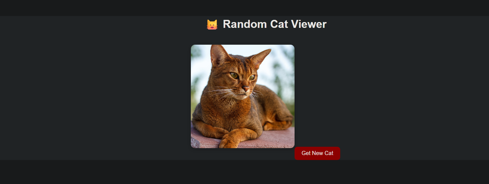
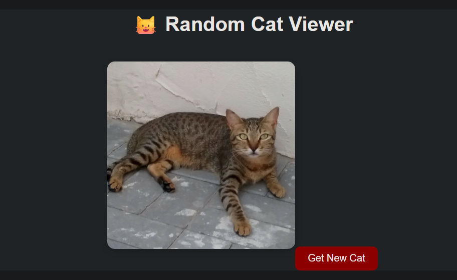
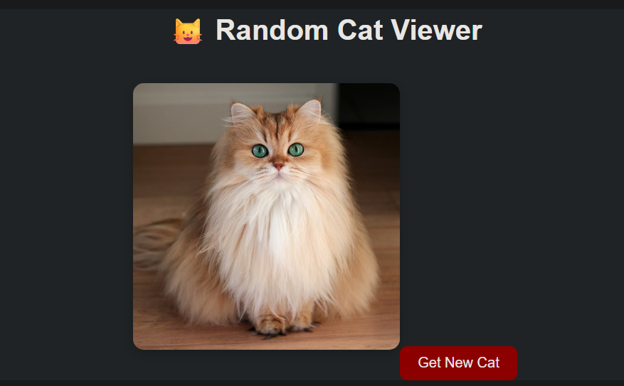

# 🐱 Random Cat Viewer

### 🚀 React API Project (Web Dev Cohort 2026)

---

## 🌐 Live Demo

🔗 [Live Preview](https://freeapi-random-cat-viewer.netlify.app/)

---

## 🧠 Overview

Random Cat Viewer is a simple and interactive React application that fetches and displays random cat images from a public API.

Users can click a button to instantly load a new random cat image, making the experience dynamic and engaging.

---

## 🎯 Objectives

* Fetch data from a public API
* Handle asynchronous operations
* Build a responsive and interactive UI
* Implement loading states for better UX

---

## 🖼️ UI Preview

### 🐾 Main Interface






---

## ⚙️ Tech Stack

| Technology        | Purpose               |
| ----------------- | --------------------- |
| React (Vite)      | Frontend framework    |
| JavaScript (ES6+) | Logic & functionality |
| CSS               | Styling               |
| Fetch API         | Data fetching         |

---

## 🌐 API Integration

**Endpoint Used:**

```id="x3w3kb"
https://api.freeapi.app/api/v1/public/cats/cat/random
```

### 🔍 Response Structure

```id="g1h7s2"
{
  data: {
    url: "image-url"
  }
}
```

👉 Image URL is accessed via:

```id="jv8d2l"
data.data.url
```

---

## 🧩 Component Structure

```id="a2d6kp"
App.jsx
 ├── Handles API fetch
 ├── Manages state
 └── Renders UI
```

---

## 🔄 Data Flow

```id="z1j2ma"
Button Click → fetch() → state update → re-render → new image display
```

---

## 📁 Folder Structure

```id="v2qk8p"
src/
 ├── App.jsx
 ├── main.jsx
 ├── styles.css
```

---

## ⚙️ Setup Instructions

### 1️⃣ Clone Repository

```id="g3d8lw"
git clone https://github.com/your-username/random-cat-viewer.git
```

### 2️⃣ Navigate to Project

```id="w2k9f7"
cd random-cat-viewer
```

### 3️⃣ Install Dependencies

```id="u6h2mc"
npm install
```

### 4️⃣ Run Development Server

```id="n9k2d1"
npm run dev
```

### 5️⃣ Open in Browser

```id="l5f8w0"
http://localhost:5173/
```

---

## 🚀 Deployment

Deployed using:

* Netlify

---

## 🎓 Learning Outcomes

* Understanding API integration in React
* Using React Hooks (`useState`, `useEffect`)
* Managing asynchronous data fetching
* Improving user experience with loading states

---

## 🤝 Contribution

This project is part of an academic assignment, but improvements are welcome.

---

## 📄 License

This project is created for educational purposes.

---

## 🙌 Acknowledgements

* FreeAPI for providing the Random Cat API
* React & Vite for development tools

---
