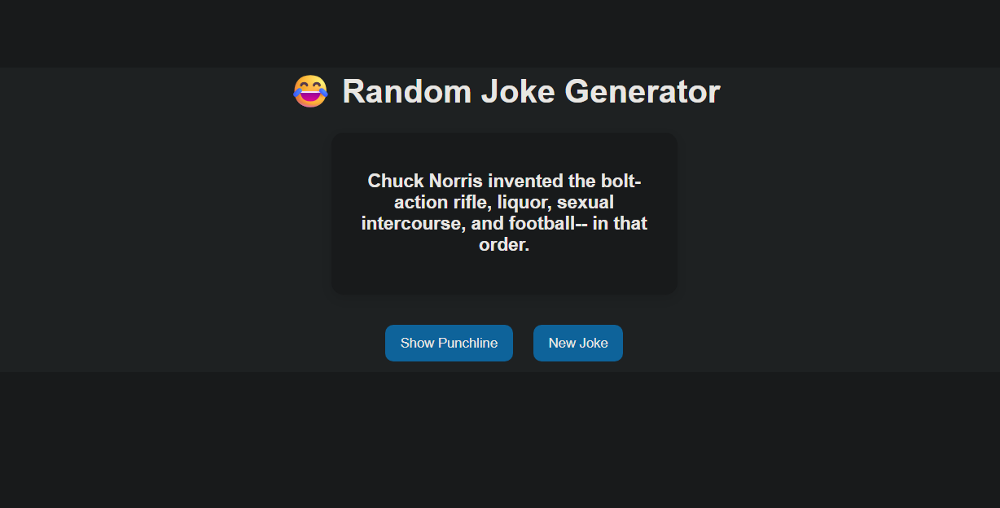

# 😂 Random Joke Generator

### 🚀 React + API Integration Project (Web Dev Cohort 2026)

---

## 🌐 Live Demo

🔗 https://your-live-link.vercel.app

---

## 🧠 Overview

The **Random Joke Generator** is a React-based web application that fetches jokes from a public API and displays them in an interactive format.

Users can:

* View a random joke
* Reveal the punchline
* Fetch a new joke instantly

This project demonstrates **API integration, state management, and user interaction in React**.

---

## 🎯 Objectives

* Fetch data from an external API
* Understand nested API response structure
* Implement conditional rendering
* Create interactive UI components
* Handle loading and asynchronous operations

---

## 🖼️ UI Preview

### 🏠 Main Interface


---

## ⚙️ Tech Stack

| Technology        | Purpose               |
| ----------------- | --------------------- |
| React (Vite)      | Frontend framework    |
| JavaScript (ES6+) | Logic & functionality |
| CSS               | Styling               |
| Fetch API         | Data fetching         |

---

## 🌐 API Integration

**Endpoint Used:**

```id="b4x9hv"
https://api.freeapi.app/api/v1/public/randomjokes
```

### 🔍 Response Structure

```id="k3qjap"
{
  statusCode: 200,
  data: {
    data: [
      {
        content: "Joke question",
        answer: "Joke punchline"
      }
    ]
  }
}
```

### 📌 Data Access

```id="c2x7zn"
data.data.data[0]
```
---

## 🧩 Component Structure

```id="x7g8q2"
App.jsx
 ├── Handles API calls
 ├── Manages state (joke, loading, UI)
 └── Renders UI
```

---

## 🔄 Data Flow

```id="5phl2a"
User Click → fetchJoke() → API Request → Response → State Update → UI Re-render
```

---

## 📁 Folder Structure

```id="c3pl9y"
src/
 ├── App.jsx
 ├── main.jsx
 ├── styles.css
```

---

## ⚙️ Installation & Setup

### 1️⃣ Clone Repository

```id="cxm4gj"
git clone https://github.com/your-username/jokes-ui.git
```

### 2️⃣ Navigate to Project

```id="fd9b6n"
cd jokes-ui
```

### 3️⃣ Install Dependencies

```id="3x5xk9"
npm install
```

### 4️⃣ Run Development Server

```id="rm8w0v"
npm run dev
```

### 5️⃣ Open in Browser

```id="y8oz6t"
http://localhost:5173/
```

---

## 🚀 Deployment

This project can be deployed using:

* Netlify

---

## 🎓 Learning Outcomes

* Understanding React Hooks (`useState`, `useEffect`)
* Handling asynchronous API calls
* Managing nested API responses
* Building interactive UI components
* Improving user experience with loading states

---

## 📸 Screenshot Guide (Important)

Add screenshots inside a folder:

```id="n0g4ur"
screenshots/
 ├── home.png
 ├── loading.png
 ├── punchline.png
```

Then use:

```id="0o7brv"

```

---

## 🤝 Contribution

This is an academic project, but improvements are welcome.

---

## 📄 License

This project is for educational purposes only.

---

## 🙌 Acknowledgements

* FreeAPI for providing the Random Jokes API
* React & Vite for development tools

---
