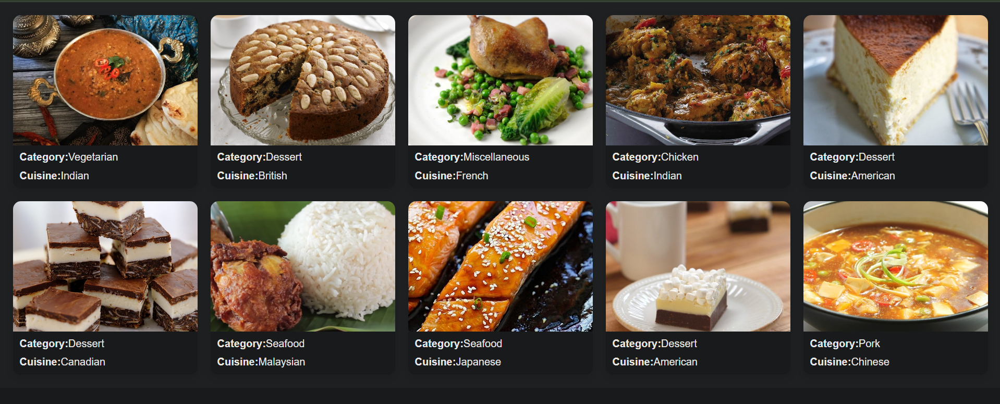

# 🍽️ Meals Listing Interface

### 🚀 React + API Integration Project (Web Dev Cohort 2026)

---

## 🌐 Demo

🔗 [Live Preview](---)

---

## 🧠 Overview

This project is a **React-based meals browsing interface** that fetches and displays recipe data from a public API.

It focuses on building a clean, user-friendly UI for exploring meals, while demonstrating core frontend concepts like API integration, state management, and component-based design.

---

## 🎯 Objectives

* Fetch and display meal data from an API
* Design a structured and visually clear UI
* Handle asynchronous data (loading & errors)
* Build reusable React components

---

## 🖼️ UI Preview

### 🏠 Meals Grid



---

## ⚙️ Tech Stack

| Technology        | Purpose               |
| ----------------- | --------------------- |
| React (Vite)      | Frontend framework    |
| JavaScript (ES6+) | Logic & functionality |
| CSS               | Styling               |
| Fetch API         | Data fetching         |

---

## 🌐 API Used

**Meals API Endpoint:**

```id="p8c7l1"
https://api.freeapi.app/api/v1/public/meals
```

---

## 🔍 API Response Structure

```id="2n6h3k"
{
  data: {
    data: [ meals ]
  }
}
```

👉 Meals accessed via:

```id="x2kq9j"
data.data.data
```

---


## 🧩 Component Architecture

```id="8n5mwr"
App.jsx
 ├── Fetch API & manage state
 └── Render MealCard components

MealCard.jsx
 └── Display individual meal details
```

---

## 🔄 Data Flow

```id="3u3a0u"
API → fetch() → state update → re-render → UI display
```

---

## 📁 Folder Structure

```id="n98o6b"
src/
 ├── components/
 │    └── MealCard.jsx
 ├── App.jsx
 ├── main.jsx
 ├── styles.css
```

---

## ⚙️ Setup Instructions

### 1️⃣ Clone Repository

```id="d1k3m0"
git clone https://github.com/your-username/meals-ui.git
```

### 2️⃣ Navigate to Project

```id="l6h8pj"
cd meals-ui
```

### 3️⃣ Install Dependencies

```id="c7t2zv"
npm install
```

### 4️⃣ Run Development Server

```id="1b9vse"
npm run dev
```

### 5️⃣ Open in Browser

```id="q8f3ld"
http://localhost:5173/
```

---

## 🚀 Deployment

Deployed using:

* Vercel

---

## 🎓 Learning Outcomes

* Understanding API integration in React
* Using React Hooks (`useState`, `useEffect`)
* Managing asynchronous data
* Component-based UI development
* Debugging common frontend errors

---

## 🤝 Contribution

This is an academic project. Suggestions and improvements are welcome.

---

## 📄 License

This project is created for educational purposes.

---

## 🙌 Acknowledgements

* FreeAPI for providing the Meals API
* React & Vite ecosystem

---
