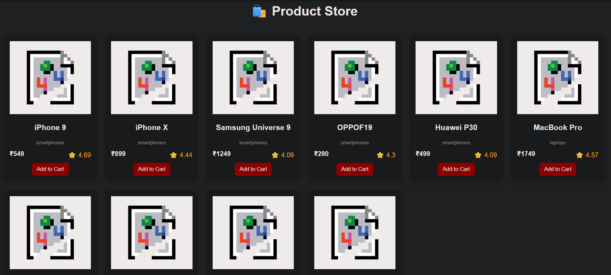

# 🛍️ Product Listing Interface

### 🚀 React + API Project (Web Dev Cohort 2026)

---

## 🌐 Live Demo

🔗 [Live Preview](https://freeapi-product-listing-interface.netlify.app/)


---

## 🧠 Overview

This project is a **React-based Product Listing Interface** that fetches product data from a public API and displays it in a clean, responsive layout similar to a basic e-commerce website.

It focuses on presenting product information clearly while maintaining a user-friendly browsing experience.

---

## 🎯 Objectives

* Fetch and display product data from an API
* Design a structured, readable UI
* Implement reusable components
* Handle loading states efficiently
* Build a responsive layout

---

## 🖼️ UI Preview

### 🏠 Product Grid

### 🏠 Main Interface



---

## ⚙️ Tech Stack

| Technology        | Purpose            |
| ----------------- | ------------------ |
| React (Vite)      | Frontend framework |
| JavaScript (ES6+) | Logic              |
| CSS               | Styling            |
| Fetch API         | Data fetching      |

---

## 🌐 API Integration

**Endpoint Used:**

```id="h4gk9r"
https://api.freeapi.app/api/v1/public/randomproducts
```

### 🔍 Response Structure (Simplified)

```id="lm0p6z"
{
  data: {
    data: [ products ]
  }
}
```

👉 Access products via:

```id="v7y3xr"
data.data.data
```
---

## 🧩 Component Architecture

```id="yhv6cw"
App.jsx
 ├── Fetch API & manage state
 └── Render ProductCard components

ProductCard.jsx
 └── Display individual product details
```

---

## 🔄 Data Flow

```id="2w4j3x"
API → fetch() → setState → re-render → UI update
```

---

## 📁 Folder Structure

```id="5m2f4t"
src/
 ├── components/
 │    └── ProductCard.jsx
 ├── App.jsx
 ├── main.jsx
 ├── styles.css
```

---

## ⚙️ Setup Instructions

### 1️⃣ Clone Repository

```id="h9d1ps"
git clone https://github.com/your-username/product-listing-ui.git
```

### 2️⃣ Navigate to Project

```id="n4c2yx"
cd product-listing-ui
```

### 3️⃣ Install Dependencies

```id="t7v8kq"
npm install
```

### 4️⃣ Run Development Server

```id="e5p2dw"
npm run dev
```

### 5️⃣ Open in Browser

```id="g7k3jh"
http://localhost:5173/
```

---

## 🚀 Deployment

Deployed using:

* Netlify

---

## 🎓 Learning Outcomes

* Working with real-world APIs
* Understanding React Hooks (`useState`, `useEffect`)
* Building reusable components
* Managing asynchronous data
* Creating responsive UI layouts

---

## 🤝 Contribution

This project is built for academic purposes. Suggestions and improvements are welcome.

---

## 📄 License

This project is created for educational use under Web Dev Cohort 2026.

---

## 🙌 Acknowledgements

* FreeAPI for providing product data
* React & Vite for development tools

---
