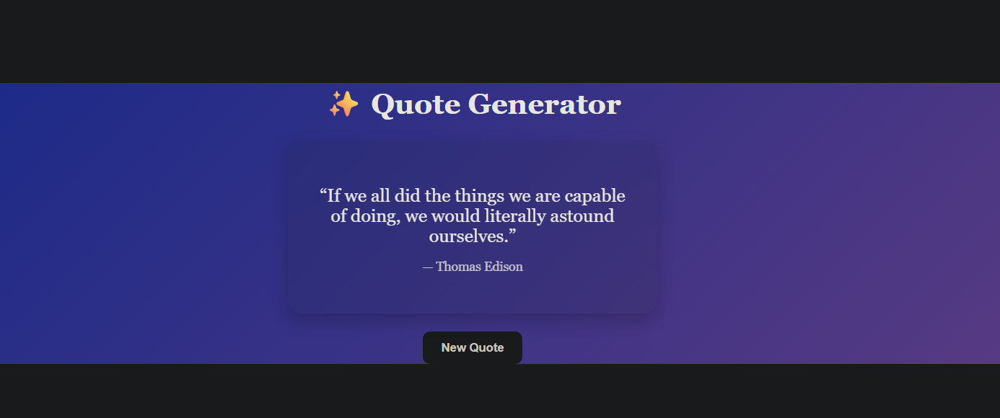

# ✨ Quotes Listing Application

### 🚀 React + API Project (Web Dev Cohort 2026)

---

## 🌐 Live Demo

🔗 [Live Preview](https://freeapi-quotes-listing-application.netlify.app/)

---

## 🧠 Overview

This project is a **Quotes Listing / Generator Application** built using React.
It fetches quotes from a public API and displays them in a clean, readable, and interactive UI.

The application is designed to provide a smooth browsing experience for inspirational quotes with a modern card-based interface.

---

## 🎯 Objectives

* Fetch and display quotes from an external API
* Understand and handle API response structure
* Build a clean and responsive UI
* Implement dynamic content rendering using React

---

## 🌐 API Used

**Endpoint:**

```id="l68qyr"
https://api.freeapi.app/api/v1/public/quotes
```

### 🔍 Response Structure

```id="rtb8x4"
{
  data: {
    data: [
      {
        content: "Quote text",
        author: "Author name"
      }
    ]
  }
}
```

👉 Quotes are accessed using:

```id="j8y0qq"
data.data.data
```

---

## ⚙️ Tech Stack

| Technology        | Purpose            |
| ----------------- | ------------------ |
| React (Vite)      | Frontend framework |
| JavaScript (ES6+) | Application logic  |
| CSS               | Styling            |
| Fetch API         | API calls          |

---

## 🖼️ UI Preview

### 🏠 Main Interface



---

## 🧩 Component Structure

```id="ph5m5f"
App.jsx
 ├── Fetch quotes from API
 ├── Store data using useState
 └── Render quote card dynamically
```

---

## 🔄 Data Flow

```id="yq48k3"
API → fetch() → state update → React re-render → UI update
```

---

## 📁 Folder Structure

```id="7hb4b6"
src/
 ├── App.jsx
 ├── main.jsx
 ├── styles.css
```

---

## ⚙️ Installation & Setup

### 1️⃣ Clone Repository

```id="bfjl8c"
git clone https://github.com/your-username/quotes-app.git
```

### 2️⃣ Navigate to Project

```id="5apxpi"
cd quotes-app
```

### 3️⃣ Install Dependencies

```id="whmr4v"
npm install
```

### 4️⃣ Run Development Server

```id="u6u86s"
npm run dev
```

### 5️⃣ Open in Browser

```id="1pvjaf"
http://localhost:5173/
```

---

## 🚀 Deployment

This project can be deployed using:

* Netlify

---

## 🎓 Learning Outcomes

* Working with real-world APIs
* Using React Hooks (`useState`, `useEffect`)
* Managing asynchronous data
* Building reusable UI components
* Creating responsive and interactive interfaces

---

## 📸 Screenshots Guide

Add images inside a `screenshots/` folder:

```id="0lm9u9"
screenshots/
 ├── home.png
 ├── new-quote.png
 ├── mobile.png
```

Display like:

```id="1g4vl6"

```

---

## 🤝 Contribution

This project is created for educational purposes, but suggestions and improvements are welcome.

---

## 📄 License

This project is developed as part of **Web Dev Cohort 2026** for learning purposes.

---

## 🙌 Acknowledgements

* FreeAPI for providing the Quotes API
* React & Vite for development tools

---
