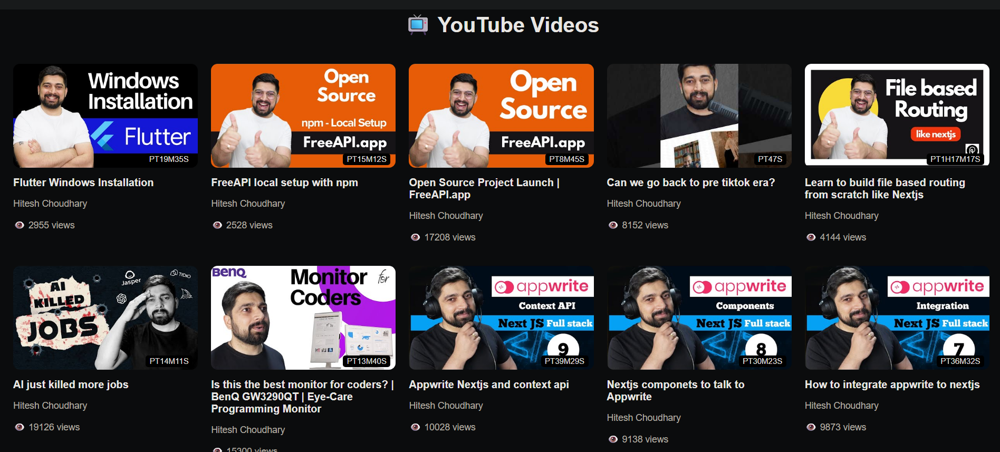

# 📺 YouTube Videos Listing UI

### 🚀 React + API Project (Web Dev Cohort 2026)

---

## 🌐 Live Demo

🔗 https://your-live-link.vercel.app

---

## 🧠 Overview

This project is a **YouTube-style video browsing interface** built using React.
It fetches video data from a public API and displays it in a clean, responsive grid layout similar to modern video platforms.

The goal is to replicate a **real-world UI experience** while working with API data and component-based architecture.

---

## 🎯 Objectives

* Fetch and display video data from an API
* Build a structured video card layout
* Design a clean and responsive UI
* Practice component-based architecture in React

---

## 🖼️ UI Preview

### 📺 Home Screen



---

## ⚙️ Tech Stack

| Technology        | Purpose                  |
| ----------------- | ------------------------ |
| React (Vite)      | Frontend framework       |
| JavaScript (ES6+) | Logic & state management |
| CSS               | Styling                  |
| Fetch API         | Data fetching            |

---

## 🌐 API Integration

**Endpoint Used:**

```id="c2l3p4"
https://api.freeapi.app/api/v1/public/youtube/videos
```

### 🔍 Response Structure (Simplified)

```id="l8r3s1"
{
  data: {
    data: [ videos ]
  }
}
```

👉 Videos accessed via:

```id="v7h1q9"
data.data.data
```

---

## 🧩 Component Architecture

```id="z4y2w8"
App.jsx
 ├── Fetch API & manage state
 └── Render VideoCard components

VideoCard.jsx
 └── Display individual video details
```

---

## 🔄 Data Flow

```id="r6k8n2"
API → fetch() → state update → re-render → UI display
```

---

## 📁 Folder Structure

```id="p5d3q1"
src/
 ├── components/
 │    └── VideoCard.jsx
 ├── App.jsx
 ├── main.jsx
 ├── styles.css
```

---

## ⚙️ Setup Instructions

### 1️⃣ Clone Repository

```id="g2m8n9"
git clone https://github.com/your-username/youtube-videos-ui.git
```

### 2️⃣ Navigate to Project

```id="b4c7t1"
cd youtube-videos-ui
```

### 3️⃣ Install Dependencies

```id="x9p2l6"
npm install
```

### 4️⃣ Run Development Server

```id="k1d5v3"
npm run dev
```

### 5️⃣ Open in Browser

```id="s3h8j4"
http://localhost:5173/
```

---

## 🚀 Deployment

This project can be deployed using:

* Netlify

---

## 🎓 Learning Outcomes

* Understanding API integration in React
* Using React Hooks (`useState`, `useEffect`)
* Designing reusable UI components
* Managing asynchronous data
* Building responsive layouts

---

## 🤝 Contribution

This is an academic project, but contributions and suggestions are welcome.

---

## 📄 License

This project is created for educational purposes.

---

## 🙌 Acknowledgements

* FreeAPI for providing video data
* React & Vite for development tools

---
