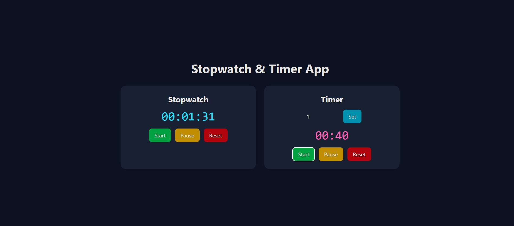

# Stopwatch & Timer App

A responsive Stopwatch and Timer application built using **React + Vite + Tailwind CSS**.

The app includes a stopwatch with start, pause, and reset controls, along with a countdown timer supporting custom time input.

## Features

### Stopwatch
- Start
- Pause
- Reset
- Live time display

### Timer
- Custom time input
- Start
- Pause
- Reset
- Auto-stop at 0

### UI
- Responsive design
- Tailwind CSS styling
- Clean and user-friendly interface
- Reusable components

---

## Tech Stack

- React
- Vite
- Tailwind CSS
- JavaScript (ES6)

---

## Project Structure

```text
src/
│
├── components/
│   ├── Controls.jsx
│   ├── Stopwatch.jsx
│   └── Timer.jsx
│
├── App.jsx
├── main.jsx
└── index.css
```

---

## Screenshots

### Main Interface



---

## Installation & Setup

Clone the repository:

```bash
git clone YOUR_GITHUB_REPO_LINK
```

Navigate to the project folder:

```bash
cd stopwatch-timer
```

Install dependencies:

```bash
npm install
```

Run the development server:

```bash
npm run dev
```

Open:

```text
http://localhost:5173
```

---

## Component Overview

### App.jsx
Main layout component that renders:
- Stopwatch
- Timer

### Controls.jsx
Reusable buttons component for:
- Start
- Pause
- Reset

### Stopwatch.jsx
Handles stopwatch logic using:
- `useState`
- `useEffect`
- `setInterval`

### Timer.jsx
Handles timer logic with:
- Custom input
- Countdown functionality
- Auto stop at zero

---

## React Hooks Used

### useState
Used for:
- Time values
- Running state
- Timer input

### useEffect
Used for:
- Interval setup
- Interval cleanup

---

## Deployment

Build project:

```bash
npm run build
```

Deploy using:
- Vercel
- Netlify

---

## Author

Built as part of **Web Dev Cohort 2026**.