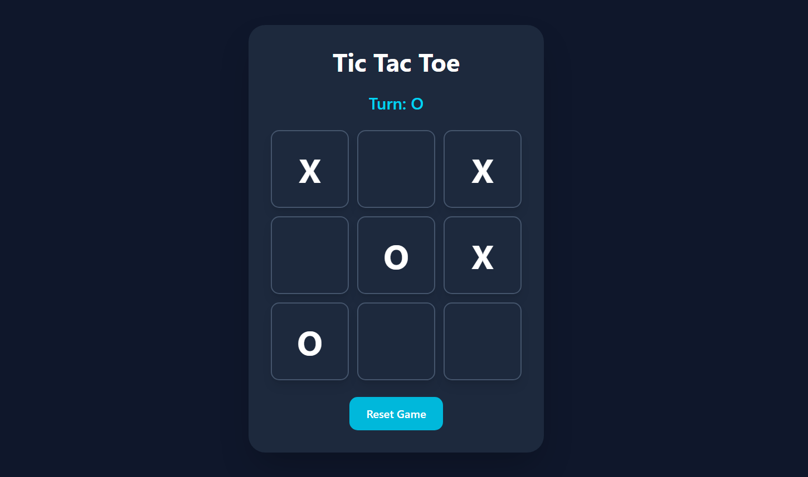

# Tic Tac Toe Game

A responsive **Tic Tac Toe game** built using **React + Vite + Tailwind CSS**.

This project features a clean UI, two-player gameplay, winner and draw detection, and reset functionality.

## Features

### Gameplay
- 3×3 game board
- Two-player turn system (X and O)
- Winner detection
- Draw detection
- Reset game option
- Current turn display
- Result display

### UI
- Responsive design
- Tailwind CSS styling
- Interactive hover effects
- Clean and user-friendly layout
- Component-based structure

---

## Tech Stack

- React
- Vite
- Tailwind CSS
- JavaScript (ES6)

---

## Project Structure

```text
src/
│
├── components/
│   ├── Board.jsx
│   ├── Square.jsx
│   └── Status.jsx
│
├── App.jsx
├── main.jsx
└── index.css
```

---

## Screenshots

### Game Interface





---

## Installation & Setup

Clone the repository:

```bash
git clone YOUR_GITHUB_REPO_LINK
```

Navigate to project folder:

```bash
cd tic-tac-toe
```

Install dependencies:

```bash
npm install
```

Run development server:

```bash
npm run dev
```

Open:

```text
http://localhost:5173
```

---

## Component Overview

### App.jsx
Main component responsible for:
- Game state
- Turn management
- Winner detection
- Reset functionality

### Board.jsx
Renders the 3×3 board using mapped Square components.

### Square.jsx
Represents an individual game cell and handles click interaction.

### Status.jsx
Displays:
- Current turn
- Winner
- Draw message

---

## React Hooks Used

### useState
Used for:
- Board state
- Player turn state

---

## Game Logic

### Winner Detection
Checks all possible winning combinations:

- Rows
- Columns
- Diagonals

### Draw Detection
If:
- No winner exists
- Board is full

Then:

```text
It's a Draw
```

---

## Deployment

Build project:

```bash
npm run build
```

Deploy using:
- Vercel
- Netlify

---

## Author

Built as part of **Web Dev Cohort 2026**.