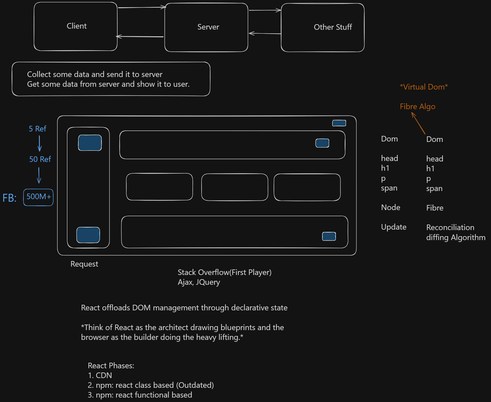

# Intro to React

React is a JavaScript library for building user interfaces.

## Core Concepts

* **Component-Based Architecture**
  Build UI using reusable components.

* **Declarative UI**
  Describe *what* the UI should look like instead of manually updating the DOM.

* **Virtual DOM**
  React updates only changed parts efficiently.

* **JSX**
  HTML-like syntax inside JavaScript.

* **Single Page Applications (SPA)**
  React apps usually load a single HTML page and dynamically update content.

---

---
# Basic Setup with Vite

## Create React App Using Vite

```bash
npm create vite@latest my-react-app
```

## Move Into Project Folder

```bash
cd my-react-app
```

## Install Dependencies

```bash
npm install
```

## Start Development Server

```bash
npm run dev
```

---

# Official Websites

* React Official Website: [React Official Website](https://react.dev/)
* Vite Official Website: [Vite Official Website](https://vite.dev/)

---

# React Architecture
```ascii
                +------------------+
                |   React App      |
                +------------------+
                          |
          ---------------------------------
          |               |               |
   +-------------+ +-------------+ +-------------+
   | Navbar      | | MainContent | | Footer      |
   +-------------+ +-------------+ +-------------+
                          |
                -------------------
                |                 |
         +-------------+   +-------------+
         | Card        |   | Button      |
         +-------------+   +-------------+
```

---

# Breakdown of React Rendering

# Step-by-Step Breakdown


---

## React Rendering Line

```jsx id="1exbyj"
createRoot(document.getElementById("root")).render(<App />);
```

This is the line where React connects your React application to the browser DOM.

---

## 1. `document.getElementById("root")`

```js id="e26pvq"
document.getElementById("root")
```

### What it does

Finds the HTML element with id `"root"` from the real DOM.

### Example HTML

```html id="dhsmcc"
<body>
  <div id="root"></div>
</body>
```

### DOM Context

* This `<div>` already exists in the browser.
* It is part of the **Real DOM**.
* React uses this element as the mounting point.

---

# 2. `createRoot(...)`
# Step-by-Step Breakdown


---

```js id="0w7s2d"
createRoot(rootElement)
```

### What it does

Creates a React root container.

### Purpose

* Initializes React’s rendering system.
* Enables React to manage updates efficiently.
* Connects React's Virtual DOM system with the Real DOM.

---

# 3. `.render(<App />)`

```jsx id="2l27ol"
render(<App />)
```

### What it does

Tells React to render the `App` component.

### JSX Context

```jsx id="ibc2ws"
<App />
```

This is JSX syntax representing a React component.

React internally converts it into JavaScript objects.

---

# Complete Rendering Flow

```ascii id="6h8k8t"
                React Component
                     |
                     v
                 <App />
                     |
                     v
            JSX -> JavaScript Object
                     |
                     v
                Virtual DOM
                     |
          Compare with Previous VDOM
                     |
              Detect Differences
                     |
                     v
                 Real DOM Update
```


---

# DOM vs Virtual DOM

## Real DOM

The actual browser structure.

```html id="fyq4n9"
<div id="root">
  <h1>Hello World</h1>
</div>
```

### Characteristics

* Slow to update repeatedly
* Browser handles rendering
* Direct manipulation is expensive

---

## Virtual DOM (VDOM)

A lightweight JavaScript representation of the DOM.

Example representation:

```js id="8nndjr"
{
  type: "h1",
  props: {
    children: "Hello World"
  }
}
```

### Characteristics

* Exists in memory
* Fast to compare
* React updates only changed parts

---

# Visual Flow of DOM and VDOM

```ascii id="6iz31s"
          +------------------+
          | React Component  |
          +------------------+
                    |
                    v
          +------------------+
          |   Virtual DOM    |
          +------------------+
                    |
            Diffing Algorithm
                    |
                    v
          +------------------+
          |    Real DOM      |
          +------------------+
                    |
                    v
               Browser UI
```

---

# Example Update Scenario

Suppose state changes:

```jsx id="0r4rj9"
<h1>Hello React</h1>
```

React will:

1. Create a new Virtual DOM
2. Compare with old Virtual DOM
3. Find only the changed text
4. Update only that part in the Real DOM

---

# Why This Is Fast

Without React:

```js id="p8y4pb"
document.body.innerHTML = "...";
```

This may re-render large parts of the page.

With React:

* React updates only necessary nodes
* Less browser work
* Better performance

---

# Full Example

## index.html

```html id="j7uq5n"
<!DOCTYPE html>
<html>
  <body>
    <div id="root"></div>
  </body>
</html>
```

---

## main.jsx

```jsx id="tt7e13"
import React from "react";
import ReactDOM from "react-dom/client";
import App from "./App";

const rootElement = document.getElementById("root");

const root = ReactDOM.createRoot(rootElement);

root.render(<App />);
```

---

# Simplified Analogy

```ascii id="wl6x3z"
Virtual DOM  = Blueprint
Real DOM     = Actual Building

React compares:
Old Blueprint vs New Blueprint

Then updates only changed rooms
instead of rebuilding entire building.
```

---


# React Rendering Flow

```ascii
        User Action
             |
             v
      +-------------+
      | React State |
      +-------------+
             |
             v
      +-------------+
      | Virtual DOM |
      +-------------+
             |
     Compare Changes
             |
             v
      +-------------+
      | Real DOM    |
      +-------------+
```

---

# React Entry File

## main.jsx

```jsx
import React from "react";
import ReactDOM from "react-dom/client";
import App from "./App";

ReactDOM.createRoot(document.getElementById("root")).render(
  <React.StrictMode>
    <App />
  </React.StrictMode>
);
```

---

# React Folder Structure

```ascii
my-react-app/
│
├── public/
├── src/
│   ├── App.jsx
│   ├── main.jsx
│   └── assets/
│
├── package.json
├── vite.config.js
└── index.html
```

---

# Example `App.jsx`

```jsx
function App() {
  return (
    <>
      <h1>Hello React + Vite</h1>
      <p>My first React app</p>
    </>
  );
}

export default App;
```

---

# Why React?

* Reusable Components
* Faster UI Updates
* Large Ecosystem
* Easy State Management
* Great Developer Experience

---

# Summary

React helps developers build modern, fast, and scalable user interfaces using reusable components and declarative programming. Combined with Vite, React development becomes extremely fast and lightweight.

## Render

```jsx id="8hmrdo"
createRoot(document.getElementById("root")).render(<App />);
```

### Meaning

| Part                              | Purpose                          |
| --------------------------------- | -------------------------------- |
| `document.getElementById("root")` | Finds real DOM container         |
| `createRoot()`                    | Creates React root system        |
| `.render(<App />)`                | Renders React component into DOM |

React uses the **Virtual DOM** to efficiently update the **Real DOM**, making UI rendering faster and smarter.

---